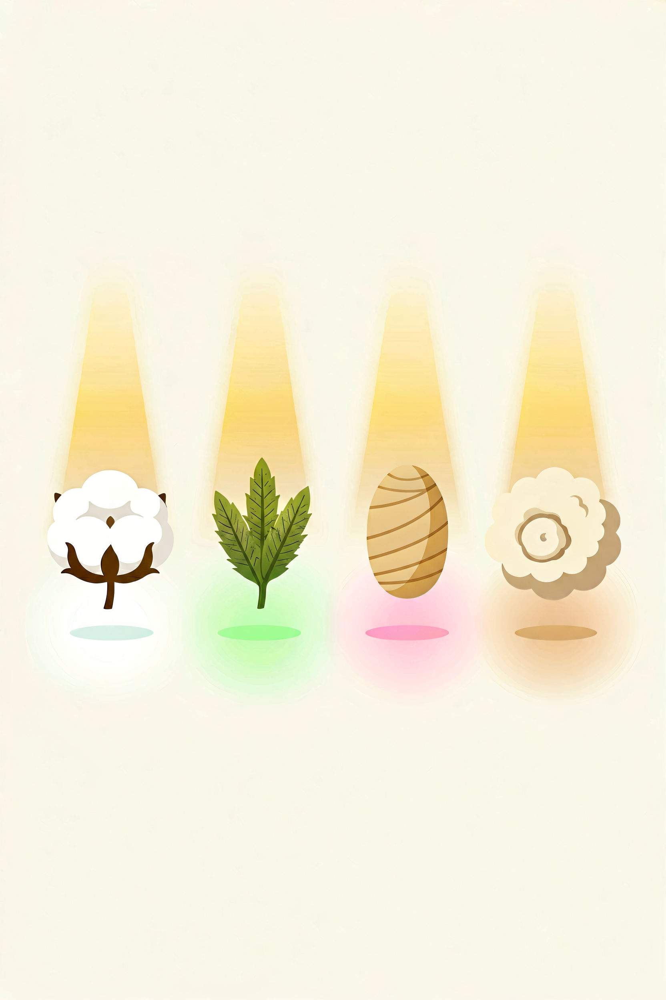

# 天然纤维指南：棉、麻、丝、毛、羊绒，到底有什么区别？

买衣服时看到标签上的"棉100%""羊毛""真丝"，你知道每种纤维的优缺点吗？

同样是棉，有的越洗越软，有的越洗越硬。同样是羊毛，有的扎人，有的可以贴身穿。

天然纤维不是"一种东西"。学会分辨它们，买衣服时就多了一双"透视眼"。

---

## 天然纤维分两类

**植物纤维**——棉、亚麻、苎麻。吸湿透气，凉感，易皱。

**动物纤维**——羊毛、羊绒、真丝、驼绒。保暖，柔软，弹性好。

两类纤维的化学结构完全不同，洗涤、保暖、透气的表现也截然不同。

---

## 棉

棉是全世界使用最广泛的天然纤维，占服装面料的 60% 以上。但棉花和棉花之间，差距可能比棉花和聚酯纤维的差距还大。

**决定棉花品质的三个核心指标：纤维长度、纤维细度、捻度。**

**长绒棉才是真正的"好棉"。** 纤维长度 ≥ 35mm，手感柔软，耐用。市面上常见的"精梳棉"只是工艺，不等于棉花品种本身。

真正的好棉花品种：海岛棉（最细最软）、埃及棉 Giza（经典长绒棉）、新疆长绒棉（品质接近埃及棉）、匹马棉 Supima（美国产）。

**棉的注意事项：** 第一次洗会缩水 3-5%，预留空间。棉容易皱，这是天然属性。避免暴晒，会发黄。长绒棉起球少，短绒棉起球多。

---

## 亚麻

亚麻是植物纤维中透气性最好的，夏天穿亚麻，体感温度比棉低 2-3℃。它的中空结构让空气流通，汗水蒸发快。

**优点：** 透气性在所有天然纤维中排第一。吸湿排汗快，出汗不粘身。有天然抗菌防臭性能。越洗越软。

**亚麻易皱——这是天然属性，不是质量问题。** 好的亚麻面料纱线均匀、手感柔软。如果买回来太硬，多洗几次就好了。亚麻不追求平整如新，它的魅力就在自然褶皱里。

---

## 真丝

真丝来自桑蚕的茧丝，是唯一的天然长纤维。一根蚕丝可以长达 1000-1500 米，这就是真丝面料光滑、不断裂的原因。

**常见品种：** 素绉缎（正面光滑、反面哑光，最经典）、双绉（哑光有弹性）、电力纺（轻薄半透明）、乔其纱（轻薄透明）。

**选购要点：** 真正的桑蚕丝燃烧时有烧头发的味道，灰烬一捏就碎。

**姆米（mm）是重量单位，姆米数越高面料越厚越耐用。** 12-16mm 适合丝巾和夏季衬衫，16-19mm 适合日常衬衫和睡衣，19-22mm+ 适合旗袍和礼服。

真丝怕汗、怕晒、怕碱性洗涤剂，需要特殊护理。

---

## 羊毛

"羊毛"这个词涵盖了很多种不同的动物毛。

**美利奴羊毛是唯一可以直接贴身穿的羊毛。** 纤维直径只有人类头发的 1/5，柔软到不扎皮肤。同时有天然吸湿排汗和抑菌功能，是户外运动内衣的首选面料。

普通羊毛（纤维直径 > 25μm）有扎感，需要内衬。小羊羔毛比普通羊毛软，但贴身穿因人而异。

**羊毛的注意事项：** 30℃ 冷水洗，不要搓揉，平铺晾干。起球用毛球修剪器处理。存放时放樟脑，密封保存。

---

## 羊绒

羊绒来自山羊的底层绒毛，不是绵羊。一只山羊每年只能产 150-200 克羊绒，一件羊绒衫需要 3-5 只山羊的绒毛——这就是羊绒贵的原因。

**羊绒的保暖性是羊毛的 1.5-2 倍，重量极轻，一件羊绒衫约 150-200g。**

**选购要点：** 羊绒含量 ≥ 95% 才能标注"纯羊绒"。100-200 元以下的"羊绒衫"基本是混纺或假货。羊绒起球是正常现象，不是质量问题。羊绒必须手洗或干洗，不能机洗。

---

## 一句话总结各纤维

**棉是日常首选，亚麻是夏天的王者，羊毛是冬天的保障，真丝是特殊场合的加分项，羊绒是奢侈的享受。**

天然纤维没有"最好"的，只有"最适合你的场景和护理习惯"的。

---

> 参考来源：GB/T 29862-2013《纺织品 纤维含量的标识》；GB/T 11951-2018《天然纤维 术语》；国际羊毛局（The Woolmark Company）标准
> 最后更新：2026-07-31