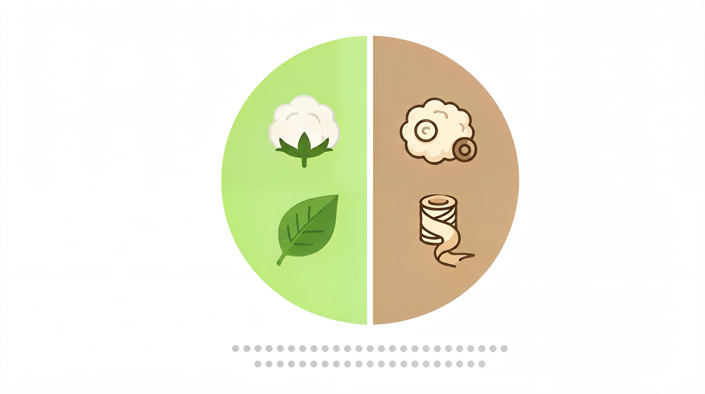
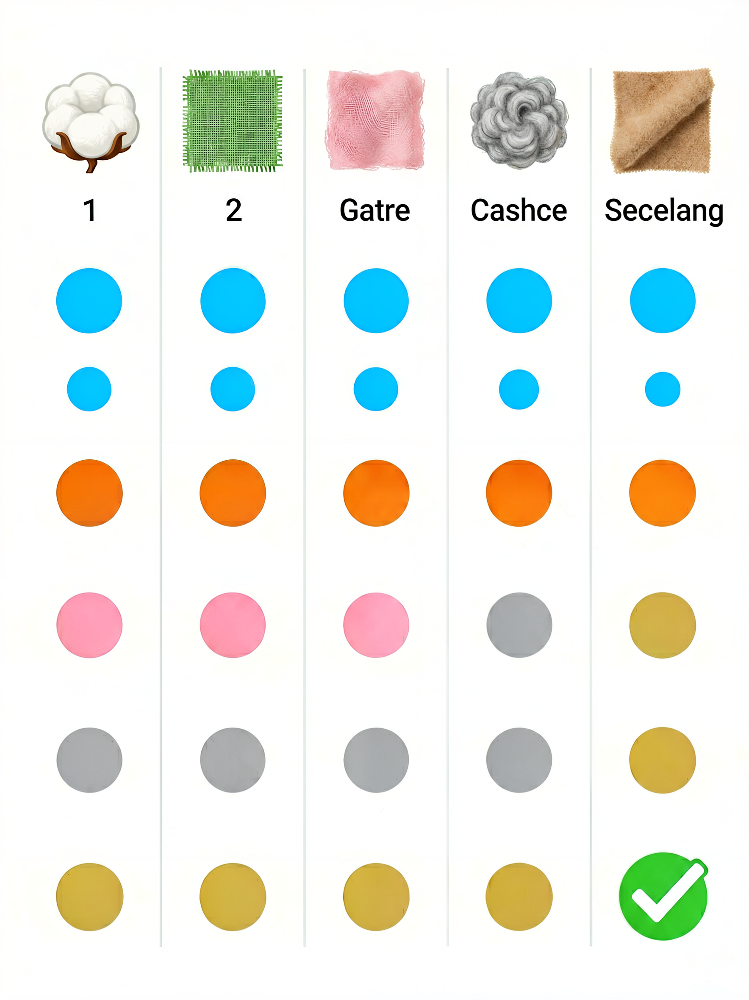

# 天然纤维指南：棉、麻、丝、毛、羊绒，到底有什么区别？


> **开篇**
>
> 你买衣服的时候，有没有注意过标签上的成分栏？
>
> "棉 100%""羊毛 100%""纯桑蚕丝"——这些词你天天见，但你可能没想过：**同样是棉，为什么有的 T 恤越洗越软，有的却越洗越硬？同样是羊毛，为什么有的扎人，有的软到可以贴身穿？**
>
> 天然纤维不是"一种东西"，每种纤维的产地、纤维长度、纺纱工艺，都会直接影响最终的面料质感。学会分辨它们，你买衣服时就多了一双"透视眼"。
>
> 这篇文章不讲品牌，不推荐产品，只讲一件事：**天然纤维到底是什么，怎么选才不踩坑。**

---

## 天然纤维分两类：植物纤维和动物纤维



天然纤维指从自然界直接获取的纤维，按来源分为两大类：

| 类别 | 来源 | 代表纤维 | 核心特点 |
|------|------|---------|---------|
| **植物纤维** | 植物种子、茎秆、叶子 | 棉、亚麻、苎麻、大麻 | 吸湿透气、凉感、易皱 |
| **动物纤维** | 动物毛发、昆虫分泌物 | 羊毛、羊绒、真丝、驼绒、马海毛 | 保暖、柔软、弹性好 |

植物纤维和动物纤维的化学结构完全不同，这也决定了它们**在洗涤、保暖、透气上的表现截然不同**。

---

## 植物纤维

### 棉——最熟悉的陌生人

棉是全世界使用最广泛的天然纤维，占服装面料的 60% 以上。但棉花和棉花之间，差距可能比棉花和聚酯纤维的差距还大。

**决定棉花品质的三个核心指标：**

| 指标 | 含义 | 优质 | 普通 |
|------|------|------|------|
| **纤维长度（ staple length）** | 单根棉花的长度 | 长绒棉（≥35mm） | 细绒棉（25-31mm） |
| **纤维细度** | 纤维越细越柔软 | 海岛棉、埃及棉 | 普通陆地棉 |
| **捻度** | 纱线加捻的紧密度 | 高捻（丝滑、耐洗） | 低捻（柔软、易起球） |

**长绒棉才是真正的"好棉"。** 市面上常见的"精梳棉"只是工艺，不等于棉花品种本身。真正的好棉花品种是：

- **海岛棉**：纤维长度可达 50mm+，最细最软，产量极少，价格极高
- **埃及棉（Giza）**：Giza 45/70/87 等品种，长绒棉中的经典
- **新疆长绒棉**：中国产的长绒棉，品质接近埃及棉
- **匹马棉（Supima）**：美国产的长绒棉，主要用在高端 T 恤和床品

**棉的常见问题：**

| 问题 | 原因 | 怎么办 |
|------|------|--------|
| 缩水 | 棉纤维遇水膨胀，干燥后收缩 | 第一次冷水洗，预留 3-5% 缩水空间 |
| 起皱 | 棉纤维弹性差 | 混纺聚酯纤维可改善，或接受它的自然质感 |
| 发黄 | 洗涤剂残留 + 暴晒 | 避免暴晒，白衣服用氧漂 |
| 起球 | 短纤维摩擦后纠缠 | 长绒棉起球少，短绒棉起球多 |

### 亚麻——越穿越舒服的"糙"面料

亚麻是植物纤维中**透气性最好的**，夏天穿亚麻，体感温度比棉低 2-3℃。它的中空结构让空气流通，汗水蒸发快。

**亚麻的优点：**
- 透气性在所有天然纤维中排第一
- 吸湿排汗快，出汗不粘身
- 有天然的抗菌防臭性能
- 越洗越软，越穿越有质感

**亚麻的"缺点"（其实是特点）：**
- 易皱——这是亚麻的天然属性，不是质量问题
- 手感偏硬——需要多次洗涤才能软化
- 纱线之间有粗节（slub）——这是亚麻的标志性特征

> **选购要点：** 好的亚麻面料纱线均匀、手感柔软。如果买回来的亚麻衣服太硬，多洗几次就好了。**亚麻不追求"平整如新"，它的魅力就在自然褶皱里。**

### 苎麻与大麻

除了亚麻，还有两种常见的麻纤维：

| 纤维 | 特点 | 常见用途 |
|------|------|---------|
| **苎麻** | 中国特产，纤维比亚麻更粗更长，手感偏硬 | 夏布、夏季服装、家用纺织品 |
| **大麻** | 比亚麻更柔软，抗菌性好，耐洗耐用 | 混纺面料、环保服装 |

---

## 动物纤维

### 羊毛——保暖界的"天花板"

羊毛是动物纤维中用量最大的，但"羊毛"这个词涵盖了很多种不同的动物毛。

**常见羊毛品种对比：**

| 品种 | 来源 | 纤维直径 | 特点 | 贴身穿？ |
|------|------|---------|------|---------|
| **美利奴羊毛** | 美利奴绵羊 | 15-22μm | 最细的羊毛，柔软不扎 | ✅ 可以 |
| **普通羊毛** | 普通绵羊 | 25-35μm | 有扎感，保暖性好 | ❌ 需要内衬 |
| **小羊羔毛（Lambswool）** | 7个月以内小羊 | 18-24μm | 比普通羊毛软 | ⚠️ 因人而异 |
| **雪兰毛（Shetland）** | 设得兰群岛绵羊 | 23-31μm | 粗犷有质感，经典毛衣面料 | ❌ 需要内衬 |

**美利奴羊毛**是唯一可以直接贴身穿的羊毛。它的纤维直径只有人类头发的 1/5，柔软到不扎皮肤。同时它还有天然的吸湿排汗和抑菌功能，户外运动内衣的首选面料。

**羊毛的常见问题：**

| 问题 | 原因 | 怎么办 |
|------|------|--------|
| 缩水 | 羊毛表面的鳞片遇热水/摩擦会纠缠 | 30℃冷水洗，不要搓揉，平铺晾干 |
| 起球 | 摩擦使短纤维纠缠成球 | 用毛球修剪器，选择长纤维羊毛 |
| 扎人 | 纤维太粗（>25μm） | 选择美利奴羊毛或加内衬 |
| 虫蛀 | 角蛋白吸引衣蛾幼虫 | 存放时放樟脑，密封保存 |

### 羊绒——真正的"软黄金"

羊绒（Cashmere）不是羊毛，它来自**山羊**的底层绒毛，不是绵羊。一只山羊每年只能产 150-200 克羊绒，一件羊绒衫需要 3-5 只山羊的绒毛，**这就是羊绒贵的原因**。

**羊绒 vs 羊毛：**

| 对比项 | 羊绒 | 美利奴羊毛 |
|--------|------|-----------|
| 纤维直径 | 14-16μm | 15-22μm |
| 保暖性 | 是羊毛的 1.5-2 倍 | 优秀 |
| 重量 | 极轻，一件羊绒衫约 150-200g | 稍重 |
| 价格 | 高（一件 500-2000+） | 中等（一件 200-800） |
| 耐久性 | 较差，容易起球变形 | 较好 |
| 贴身穿 | ✅ 可以 | ✅ 可以 |

**选购羊绒的注意事项：**
- 羊绒含量 ≥ 95% 才能标注"纯羊绒"
- 100-200 元以下的"羊绒衫"基本是混纺或假货
- 羊绒起球是正常现象，不是质量问题
- 羊绒必须手洗或干洗，不能机洗

### 真丝——最亲肤的天然纤维

真丝（Silk）来自**桑蚕**的茧丝，是唯一的天然长纤维。一根蚕丝可以长达 1000-1500 米，这就是真丝面料光滑、不断裂的原因。

**真丝的常见品种：**

| 品种 | 织法特点 | 质感 | 常见用途 |
|------|---------|------|---------|
| **素绉缎** | 正面光滑、反面哑光 | 最经典的真丝面料，光泽感强 | 衬衫、连衣裙、睡衣 |
| **双绉** | 双面起皱 | 哑光、有弹性、不贴身 | 衬衫、连衣裙 |
| **电力纺** | 平纹织造 | 轻薄、半透明 | 丝巾、内衬 |
| **乔其纱** | 强捻纱线 | 轻薄、透明、有弹性 | 丝巾、连衣裙外层 |
| **绸缎（Satine）** | 缎纹织造 | 厚重、光泽强 | 旗袍、礼服 |

**真丝的选购要点：**
- 真正的桑蚕丝燃烧时有**烧头发的味道**，灰烬一捏就碎
- 姆米（mm/momme）是重量单位，**姆米数越高，面料越厚越耐用**
  - 12-16mm：轻薄，适合丝巾、夏季衬衫
  - 16-19mm：中等厚度，适合日常衬衫、睡衣
  - 19-22mm+：厚重，适合旗袍、礼服
- 真丝怕汗、怕晒、怕碱性洗涤剂，需要特殊护理

### 其他珍贵动物纤维

| 纤维 | 来源 | 特点 | 价格 |
|------|------|------|------|
| **驼绒（Alpaca）** | 羊驼 | 比羊绒更轻、更保暖，不起球 | 高 |
| **马海毛（Mohair）** | 安哥拉山羊 | 纤维长而有光泽，有毛茸茸的质感 | 中高 |
| **羊驼毛（Vicuña）** | 小羊驼 | 最稀有最贵的动物纤维，直径仅 12-13μm | 极高（一件大衣数万元） |
| **牦牛绒** | 牦牛 | 柔软保暖，颜色天然（深棕/灰） | 中高 |

---

## 各天然纤维综合评价



| 维度 | 棉 | 亚麻 | 真丝 | 羊毛 | 羊绒 |
|:----|:---|:----|:----|:----|:----|
| **透气性** | ★★★★ | ★★★★★ | ★★★ | ★★★ | ★★★★ |
| **保暖性** | ★★ | ★ | ★★ | ★★★★★ | ★★★★★★ |
| **柔软度** | ★★★★ | ★★ | ★★★★★ | ★★★ | ★★★★★ |
| **耐久性** | ★★★ | ★★★★ | ★★ | ★★★ | ★★ |
| **易护理** | ★★★★ | ★★★ | ★ | ★★ | ★★ |
| **价格** | 低-中 | 中 | 中-高 | 中-高 | 高-极高 |
| **环保性** | ★★★★ | ★★★★★ | ★★★ | ★★★★ | ★★★★ |

---

## 分场景选择

### 日常通勤（办公室）

| 场景 | 推荐纤维 | 说明 |
|------|---------|------|
| 夏季通勤 | 棉、亚麻 | 透气不闷汗，适合有空调的室内 |
| 春秋通勤 | 棉、羊毛混纺 | 保暖适中，不易皱 |
| 冬季通勤 | 羊毛、羊绒 | 保暖且不臃肿 |

### 运动与户外

| 场景 | 推荐纤维 | 说明 |
|------|---------|------|
| 低强度运动（瑜伽、散步） | 棉、棉混纺 | 吸汗舒适 |
| 高强度运动（跑步、骑行） | 美利奴羊毛 | 排汗快、不臭（比棉更合适） |
| 户外徒步 | 美利奴羊毛 | 保暖排汗、不臭、可多天穿 |

### 特殊场合

| 场景 | 推荐纤维 | 说明 |
|------|---------|------|
| 正式场合 | 羊毛精纺、真丝 | 光泽感好、版型挺括 |
| 婚礼/晚宴 | 真丝 | 有光泽、显质感 |
| 睡觉 | 棉、真丝 | 真丝对皮肤摩擦最小 |

---

## 常见误区

### 误区 1：「纯棉一定比化纤好」

纯棉舒服，但不适合所有场景。运动时穿纯棉，汗水会被棉纤维吸收，湿透后贴在身上，反而容易着凉。**运动时美利奴羊毛或速干化纤比纯棉更合适。**

### 误区 2：「羊绒起球就是质量不好」

羊绒纤维短、表面光滑度低，摩擦后起球是正常现象，**与质量无关**。真正的问题不是"起不起球"，而是"起球后能不能恢复"。好的羊绒起球后轻轻修剪即可，差的羊绒起球后直接秃了。

### 误区 3：「真丝越厚越好」

真丝的姆米数要根据用途选。12-16mm 的轻薄真丝适合丝巾和夏季衬衫，19mm 以上的适合旗袍和礼服。**不是越厚越好，是越适合越好。**

### 误区 4：「亚麻太容易皱了，质量不好」

亚麻的天然属性就是易皱，这不是质量缺陷。**亚麻的褶皱本身就是它的风格特征。** 如果你追求平整如新，亚麻不适合你；如果你追求自然透气，亚麻是最好的选择。

### 误区 5：「羊毛不能水洗」

美利奴羊毛和经过防缩处理（Superwash）的羊毛是可以机洗的，但需要冷水、轻柔模式、羊毛专用洗涤剂。**普通羊毛确实不能热水洗，但冷水中手洗是安全的。**

---

## 决策清单

买衣服时，按这个顺序判断面料是否适合你：

```
1. 看标签上的纤维成分
   → 100% 棉/羊毛/真丝？还是混纺？混纺比例是多少？

2. 判断纤维品质
   → 棉：长绒棉 > 普通棉
   → 羊毛：美利奴 > 普通羊毛
   → 真丝：桑蚕丝 > 柞蚕丝，姆米数越高越好

3. 匹配场景
   → 夏天贴身穿：棉、亚麻、真丝
   → 冬天保暖：羊毛、羊绒
   → 运动：美利奴羊毛
   → 正式场合：羊毛精纺、真丝

4. 考虑护理成本
   → 棉、亚麻：好打理，随便洗
   → 真丝、羊绒：需要特殊护理，时间成本高
   → 羊毛：介于两者之间

5. 确认预算
   → 棉：几十到几百
   → 亚麻：一百到四五百
   → 羊毛：二百到上千
   → 真丝：三百到上千
   → 羊绒：五百到几千
```

---

> **一句话总结：** 天然纤维没有"最好"的，只有"最适合你的场景和护理习惯"的。**棉是日常首选，亚麻是夏天的王者，羊毛是冬天的保障，真丝是特殊场合的加分项，羊绒是奢侈的享受。**

---

> 参考来源：GB/T 29862-2013《纺织品 纤维含量的标识》；GB/T 11951-2018《天然纤维 术语》；国际羊毛局（The Woolmark Company）标准
> 最后更新：2026-07-31