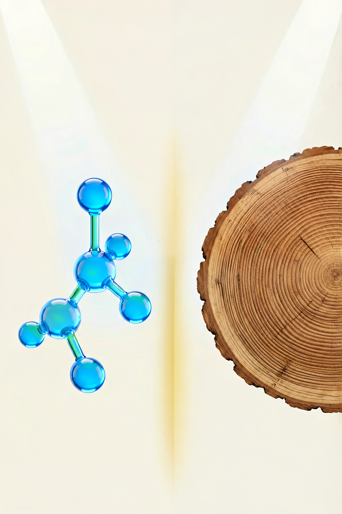
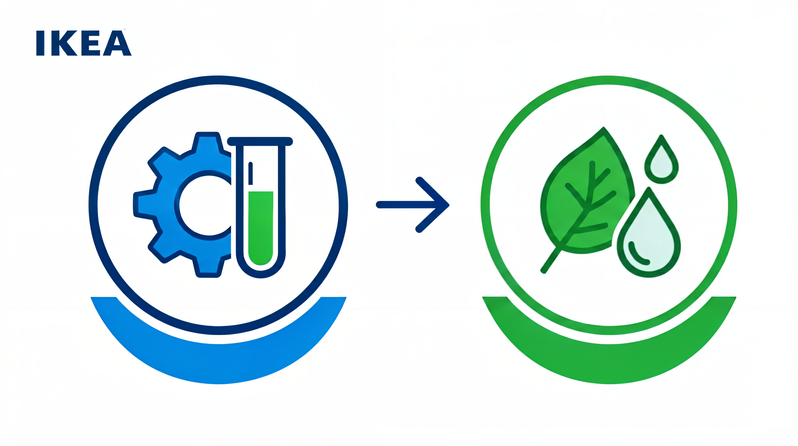
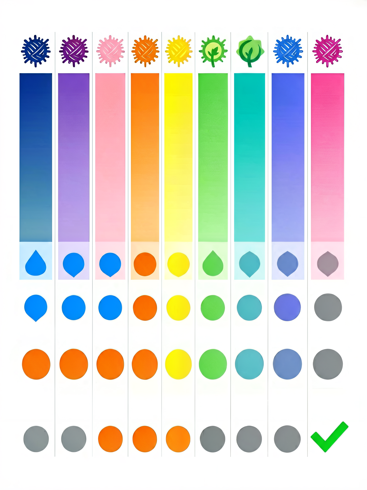

# 合成纤维与再生纤维指南：聚酯纤维、尼龙、天丝、莫代尔……它们到底是什么？



> **开篇**
>
> 你翻出一件衣服的标签，看到"聚酯纤维 100%"，心里可能想："又是化纤，不透气吧。"
>
> 但你衣柜里那些"纯棉"T 恤，可能穿一天就变形了；而你那条穿了五年的运动裤，标签上写的就是"聚酯纤维 100%"——它依然弹性如初。
>
> **化纤不等于廉价。** 事实上，很多"化纤"的性能远超天然纤维，尤其是在运动、户外、保暖领域。而"再生纤维"如天丝、莫代尔，则模糊了天然和化学的边界——它们来自天然木材，却通过化学工艺变成了比棉更柔软的面料。
>
> 这篇文章帮你理清：**合成纤维和再生纤维到底有什么区别，各自适合什么场景。**

---

## 合成纤维和再生纤维是两回事

很多人把"化纤"当成一个概念，但实际分为两大类：



| 类别 | 原料来源 | 制造方式 | 代表纤维 |
|------|---------|---------|---------|
| **合成纤维** | 石油、天然气 | 化学聚合 | 聚酯纤维、尼龙、腈纶、氨纶、丙纶 |
| **再生纤维** | 天然植物（木材、棉花短绒） | 化学溶解后再纺丝 | 黏胶、莫代尔、天丝、铜氨、醋酸 |

**合成纤维**是从石油中提取的——和塑料是同一种来源。**再生纤维**的原料是天然木材或棉花，但经过化学处理变成了丝状。前者是"人造的"，后者是"天然改造的"。

---

## 合成纤维

### 聚酯纤维（涤纶）——最全能、最常用的合成纤维

聚酯纤维（Polyester），在中国常被称为"涤纶"，是产量最大的合成纤维，占全球纤维产量的 50% 以上。

**聚酯纤维的优点：**
- 强度高、耐磨、不易变形
- 快干——洗完后几小时就能干
- 不缩水、不皱
- 价格低

**聚酯纤维的缺点：**
- 透气性差，纯聚酯纤维穿久了会闷
- 容易产生静电
- 亲水性差，不吸汗（汗水会留在皮肤表面）

> **选购要点：** 纯聚酯纤维的衣服透气性确实不好，但聚酯纤维和棉的混纺（如棉 65% + 聚酯纤维 35%）可以兼顾舒适和耐用。**100% 聚酯纤维适合运动服和外套，贴身衣物建议选混纺。**

### 尼龙（锦纶）——最耐磨的合成纤维

尼龙（Nylon），中国称"锦纶"，是世界上第一种合成纤维（1935 年由杜邦公司发明）。

**尼龙 vs 聚酯纤维：**

| 对比项 | 尼龙 | 聚酯纤维 |
|--------|------|---------|
| 耐磨性 | ★★★★★ 最强 | ★★★★ 强 |
| 弹性 | ★★★★★ 很好 | ★★★ 一般 |
| 吸湿性 | ★★★ 比聚酯好一点 | ★★ 差 |
| 耐光性 | ★★ 怕晒 | ★★★★ 好 |
| 价格 | 中高 | 低-中 |

**尼龙最适合的场景：**
- 瑜伽服、运动紧身衣（需要弹性的场合）
- 羽绒服面料（防钻绒、耐磨）
- 背包、帐篷、户外装备
- 丝袜（尼龙是最早的丝袜材料）

### 氨纶（莱卡/弹性纤维）——给衣服弹性的"隐形功臣"

氨纶（Spandex/Elastane），在中国常被称为"莱卡"（但莱卡是某个公司的商品名，不是纤维名称）。氨纶几乎从不单独使用，而是以 **2-10%** 的比例混入其他纤维，赋予面料弹性。

**氨纶的常见混纺比例：**

| 混纺比例 | 效果 | 常见用途 |
|---------|------|---------|
| 2-3% | 轻微弹性，保形性好 | 牛仔裤、衬衫 |
| 5-7% | 明显弹性，穿着舒适 | T恤、连衣裙、休闲裤 |
| 10-15% | 高弹性，紧身 | 瑜伽裤、运动紧身衣 |
| 20%+ | 超高弹性 | 泳装、塑身衣 |

> **选购要点：** 弹性不是越多越好。日常穿着的衣服，**2-5% 的氨纶就足够了**——太多氨纶会让衣服像"绑"在身上，而且氨纶含量越高，面料越容易老化松垮。

### 腈纶（亚克力纤维）——羊毛的"平价替代品"

腈纶（Acrylic）的质感接近羊毛，常被用来做毛衣、毛毯、人造毛。

**腈纶 vs 羊毛：**

| 对比项 | 腈纶 | 羊毛 |
|--------|------|------|
| 保暖性 | ★★★ 中等 | ★★★★★ 好 |
| 手感 | ★★★ 可接近羊毛 | ★★★★ 柔软 |
| 重量 | 轻 | 中等 |
| 起球 | ★★ 容易起球 | ★★★ 适中 |
| 价格 | 低 | 中-高 |
| 护理 | 可机洗 | 需手洗或干洗 |

**腈纶的常见问题：** 起球是腈纶最大的痛点。纯腈纶毛衣穿几次就会起球，这是材料特性，不是质量问题。如果介意起球，选择羊毛混纺（羊毛+腈纶）会好很多。

### 丙纶（聚丙烯纤维）——排汗最快的纤维

丙纶（Polypropylene）是合成纤维中**吸湿性最低**的——它几乎不吸水。这听起来像缺点，但恰好让它成为排汗效果最好的纤维。

**丙纶的独特优势：**
- 完全不吸水，汗水直接透过纤维排出（不像棉会吸汗后贴在身上）
- 最轻的纤维，比水轻，浮在水上
- 保暖性好，即使在潮湿时也能保暖

**丙纶的缺点：**
- 不耐高温，不能熨烫
- 手感偏硬
- 不太常见，多用于专业运动内衣和户外保暖层

---

## 再生纤维

再生纤维是从天然植物中提取的纤维素，通过化学溶解后再纺丝制成的纤维。它们**既有天然纤维的舒适感，又具备一些合成纤维的稳定性**。

### 黏胶纤维（人造丝）——最古老的再生纤维

黏胶（Viscose/Rayon）是第一种再生纤维，1892 年发明，被称为"人造丝"。

**特点：**
- 手感柔软光滑，接近真丝
- 吸湿性好，比棉还吸水
- 价格便宜
- 湿强低——湿了之后强度只有干时的 50%，容易破损

> **选购要点：** 黏胶纤维的衣服 **不要用力搓洗**，湿的状态下很脆弱。100% 黏胶的衬衫洗几次后容易变形，选择黏胶+聚酯纤维的混纺会更耐用。

### 莫代尔——比棉更软、比棉更环保

莫代尔（Modal）是黏胶的升级版，由奥地利兰精公司（Lenzing）在 1960 年代开发。原料来自欧洲山毛榉木。

**莫代尔 vs 棉：**

| 对比项 | 莫代尔 | 棉 |
|--------|--------|------|
| 柔软度 | ★★★★★ 非常软 | ★★★★ 软 |
| 吸湿性 | ★★★★★ 比棉强 50% | ★★★★ 好 |
| 缩水率 | 低 | 3-5% |
| 耐久性 | ★★★ 湿后强度下降 | ★★★★ 好 |
| 价格 | 中 | 低-中 |

**莫代尔最适合的场景：**
- 内衣、内裤（柔软亲肤）
- 家居服、睡衣
- 孕妇装、婴儿服装
- 贴身穿的 T 恤

### 天丝（莱赛尔纤维）——最环保的再生纤维

天丝（Tencel/Lyocell）是再生纤维中最先进的一代，同样由兰精公司开发。它的原料是桉树木浆，制造过程使用**闭环工艺**（溶剂回收率 99%+），是公认的环保纤维。

**天丝 vs 莫代尔：**

| 对比项 | 天丝 | 莫代尔 |
|--------|------|--------|
| 原料 | 桉树 | 山毛榉 |
| 制造工艺 | 闭环工艺，环保 | 传统工艺，环保性中等 |
| 手感 | 丝滑、凉感 | 柔软、温暖感 |
| 强度 | 干湿强度都高 | 湿强度一般 |
| 价格 | 中高 | 中 |

**天丝最独特的特性是"凉感"。** 天丝面料的接触凉感系数（Q-max 值）比棉高 30% 以上，夏天穿天丝面料的衣服，体感明显比棉凉快。

### 铜氨纤维——真丝的最佳平价替代

铜氨纤维（Cupro）是以棉花短绒（棉籽上的短纤维）为原料制成的再生纤维。它的纤维比真丝还细（约 1-2 旦），手感极其柔滑。

**特点：**
- 手感最接近真丝的再生纤维
- 吸湿排汗性能好
- 抗静电
- 价格比真丝低，但比莫代尔高
- 产量少，主要用在高端服装的里衬和轻薄衬衫

### 醋酸纤维——光泽感最好的再生纤维

醋酸纤维（Acetate）是以木浆为原料，经过醋酸酯化处理制成的。它的光泽感在所有再生纤维中最强，看起来像真丝。

**特点：**
- 光泽感强，外观接近真丝
- 手感顺滑，悬垂性好
- 吸湿性差（比真丝差）
- 强度低，容易破损
- 主要用在礼服、丝巾、里衬

---

## 各化纤综合评价



| 纤维 | 透气性 | 弹性 | 耐磨 | 手感 | 易护理 | 价格 | 环保 |
|:----|:-----:|:----:|:---:|:----:|:-----:|:---:|:---:|
| **聚酯纤维** | ★★ | ★★★ | ★★★★ | ★★ | ★★★★★ | 低 | ★★ |
| **尼龙** | ★★★ | ★★★★★ | ★★★★★ | ★★★ | ★★★★ | 中 | ★★ |
| **氨纶** | ★★ | ★★★★★★★ | ★★ | ★★★ | ★★★ | 中 | ★★ |
| **腈纶** | ★★★ | ★★ | ★★★ | ★★★ | ★★★★ | 低 | ★★ |
| **丙纶** | ★★★★ | ★★★ | ★★★ | ★★ | ★★ | 中 | ★★★ |
| **黏胶** | ★★★★ | ★ | ★★ | ★★★★ | ★★ | 低 | ★★★ |
| **莫代尔** | ★★★★★ | ★★ | ★★★ | ★★★★★ | ★★★ | 中 | ★★★★ |
| **天丝** | ★★★★★ | ★★ | ★★★★ | ★★★★★ | ★★★★ | 中高 | ★★★★★ |
| **铜氨** | ★★★★ | ★ | ★★ | ★★★★★ | ★★★ | 中高 | ★★★★ |
| **醋酸** | ★★ | ★ | ★ | ★★★★ | ★★ | 中 | ★★★ |

---

## 分场景选择

### 日常通勤

| 需求 | 推荐纤维 | 说明 |
|------|---------|------|
| 夏季通勤 | 天丝、莫代尔、棉涤混纺 | 天丝有凉感，莫代尔透气，棉涤混纺不易皱 |
| 春秋通勤 | 聚酯纤维+羊毛混纺 | 不易皱，保暖适中 |
| 正式场合 | 黏胶/铜氨（仿丝效果） | 光泽感好，价格比真丝低 |

### 运动与户外

| 需求 | 推荐纤维 | 说明 |
|------|---------|------|
| 跑步/骑行 | 聚酯纤维、丙纶 | 速干排汗，不吸水 |
| 瑜伽/健身 | 尼龙+氨纶 | 弹性好，耐磨 |
| 户外徒步 | 尼龙、聚酯纤维 | 耐磨、速干、轻量 |
| 游泳 | 聚酯纤维+氨纶 | 耐氯、快干、有弹性 |

### 贴身衣物

| 需求 | 推荐纤维 | 说明 |
|------|---------|------|
| 内裤 | 莫代尔、棉+氨纶 | 莫代尔最柔软，棉氨混纺舒适有弹性 |
| 睡衣 | 莫代尔、天丝 | 柔软亲肤，透气性好 |
| 袜子 | 棉+聚酯纤维+氨纶 | 棉吸汗，聚酯纤维耐磨，氨纶保形 |

---

## 常见误区

### 误区 1：「化纤 = 便宜货」

化纤≠廉价。高性能尼龙、天丝、铜氨纤维的价格可能超过普通纯棉。**决定价格的不是"是不是化纤"，而是纤维的品质和工艺。**

### 误区 2：「再生纤维是化工产品，不环保」

再生纤维的环保性取决于制造工艺。**天丝（莱赛尔纤维）的闭环工艺溶剂回收率达 99% 以上，比普通棉花的种植更环保。** 棉花种植消耗大量水资源和农药，而天丝的原料来自可持续管理的桉树林。

### 误区 3：「聚酯纤维完全不透气」

纯聚酯纤维确实不透气，但现代纺织技术通过**异形截面纤维**（如十字形、中空纤维）和**编织结构优化**，可以显著改善透气性。专业运动服装的聚酯纤维面料，透气性可能比纯棉更好。

### 误区 4：「氨纶越多弹性越好」

氨纶确实提供弹性，但氨纶含量超过一定比例后，弹性超过舒适需要的范围，反而会让衣服像"绑"在身上。**日常穿着的衣服，2-5% 的氨纶就足够了。**

### 误区 5：「黏胶是真丝」

黏胶纤维和真丝虽然手感相似，但完全不是一回事。**黏胶是再生纤维素纤维，真丝是动物蛋白纤维。** 黏胶湿了之后强度下降，真丝湿了之后强度反而上升。价格上，真丝通常是黏胶的 3-10 倍。

---

## 决策清单

买衣服时，按这个顺序判断合成/再生纤维的选择：

```
1. 看标签上的纤维成分
   → 是合成纤维（聚酯/尼龙/氨纶）还是再生纤维（黏胶/莫代尔/天丝）？

2. 确定使用场景
   → 运动/户外：聚酯纤维、尼龙、丙纶
   → 贴身/家居：莫代尔、天丝、棉+氨纶
   → 通勤/日常：棉涤混纺、天丝、聚酯纤维+羊毛

3. 检查混纺比例
   → 弹性需求：氨纶 2-5%
   → 耐用需求：聚酯纤维 30-50%
   → 舒适优先：天然/再生纤维占比 70%+

4. 判断品质等级
   → 普通聚酯纤维 vs 异形截面聚酯纤维（性能差异大）
   → 普通黏胶 vs 莫代尔 vs 天丝（品质递进）

5. 考虑护理方式
   → 聚酯纤维、尼龙：随便洗
   → 黏胶：不能湿搓
   → 天丝、莫代尔：正常机洗没问题
```

---

> **一句话总结：** 合成纤维和再生纤维不是"廉价替代品"，它们是**为解决天然纤维的特定短板而生的工程材料**。聚酯纤维适合运动，尼龙适合弹性装备，天丝适合夏天贴身穿，莫代尔适合内衣——选对场景，化纤比天然纤维更好用。

---

> 参考来源：GB/T 4146.1-2020《纺织品 化学纤维 第1部分：通用术语》；GB/T 29862-2013《纺织品 纤维含量的标识》；Lenzing AG 纤维技术资料
> 最后更新：2026-07-31