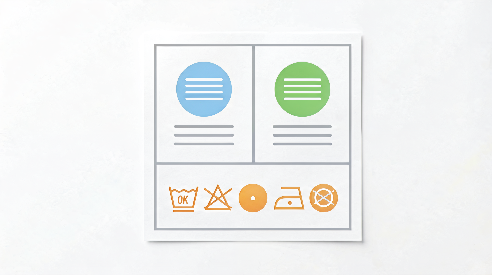
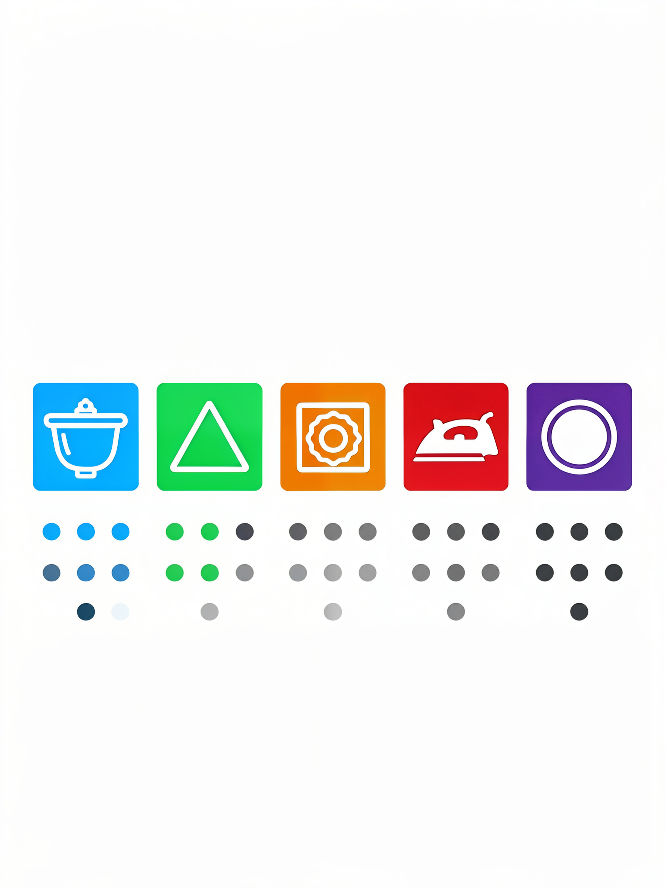

# 面料标签全解读：买衣服前必看的 3 行字


> **开篇**
>
> 你买衣服的时候，有没有翻到标签看过？
>
> 大多数人只看价格和尺码，最多摸一下面料手感。但标签上那几行小字，包含的信息量比你想象的多得多——**纤维成分、安全类别、洗涤方式、执行标准**，全印在上面。
>
> 更关键的是：**服装标签是受国家强制标准约束的。** 标签上写"棉 100%"，就必须是 100% 棉；写"B 类"，就必须达到 B 类的安全标准。这不是广告词，是法律要求。
>
> 学会看标签，你就不会被"冰丝""天丝""竹纤维"这些营销词绕晕。这篇文章手把手教你：**标签上的每一行字，到底在说什么。**

---

## 标签上的核心信息



一件合格的衣服，标签上必须包含以下信息（根据 GB/T 5296.4-2012《消费品使用说明 第4部分：纺织品和服装》）：

| 信息 | 位置 | 说明 |
|------|------|------|
| **纤维成分及含量** | 耐久标签（洗唛） | 如"棉 100%"或"棉 65%，聚酯纤维 35%" |
| **安全类别** | 耐久标签或吊牌 | A类/B类/C类 |
| **洗涤维护符号** | 耐久标签 | 5 个符号一组，按顺序解读 |
| **产品名称** | 吊牌 | 如"男式衬衫""连衣裙" |
| **执行标准** | 吊牌 | 如"GB/T 2660-2017" |
| **生产厂家/地址** | 吊牌 | 生产者名称和地址 |
| **尺码规格** | 耐久标签 | 如"175/92A" |

其中，**纤维成分、安全类别、洗涤符号**是最核心的三项信息，也是买衣服时最值得看的。

---

## 怎么看纤维成分

纤维成分标签必须标注所有纤维的**中文名称**和**百分比含量**，按含量从高到低排列。

### 常见纤维名称对照

**有些商家会用营销词代替标准名称，这是违规的。** 根据 GB/T 29862-2013，标签必须使用标准名称：

| 营销词（不规范的） | 标准名称 | 实际是什么 |
|-------------------|---------|-----------|
| 冰丝 | 黏胶纤维或聚酯纤维 | 通常是黏胶，有时是聚酯 |
| 天丝 | 莱赛尔纤维 | 天丝是品牌名，不是纤维名 |
| 竹纤维 | 竹浆黏胶纤维 | 本质是黏胶，原料是竹子 |
| 牛奶丝 | 牛奶蛋白改性聚丙烯腈纤维 | 含少量蛋白的合成纤维 |
| 大豆纤维 | 大豆蛋白改性聚乙烯醇纤维 | 同上 |
| 莫代尔 | 莫代尔纤维 | 这个标准名就是莫代尔 |
| 莱卡 | 氨纶 | 莱卡是品牌名，不是纤维名 |
| 钻石棉 | 聚酯纤维 | 纯营销词 |

> **选购要点：** 如果标签上写的是"冰丝""天丝"而不是标准名称，说明商家在打擦边球。**正规标签应该使用 GB/T 29862 规定的标准名称。**

### 混纺比例的含意

| 常见混纺 | 意图 | 效果 |
|---------|------|------|
| 棉 65% + 聚酯纤维 35% | 棉的舒适 + 聚酯的挺括 | 不易皱，耐用，但透气性比纯棉差 |
| 棉 95% + 氨纶 5% | 棉的舒适 + 氨纶的弹性 | 有弹性，保形性好 |
| 羊毛 70% + 聚酯纤维 30% | 羊毛的质感 + 聚酯的耐用 | 比纯羊毛便宜，不易起球 |
| 黏胶 70% + 聚酯纤维 30% | 黏胶的丝滑 + 聚酯的强度 | 手感好，耐用 |
| 棉 50% + 莫代尔 50% | 棉的挺括 + 莫代尔的柔软 | 比纯棉软，比纯莫代尔有型 |

**简单说：** 天然纤维比例越高越舒服，合成纤维比例越高越耐用。混纺是为了在两者之间找到平衡。

---

## 怎么看安全类别

安全类别是 **GB 18401-2010《国家纺织产品基本安全技术规范》** 规定的强制性标准，分为三类：

| 类别 | 甲醛含量上限 | pH 值范围 | 色牢度要求 | 适用产品 |
|------|------------|----------|-----------|---------|
| **A类（婴幼儿）** | ≤ 20 mg/kg | 4.0-7.5 | 最高 | 婴幼儿用品（36个月以下） |
| **B类（直接接触皮肤）** | ≤ 75 mg/kg | 4.0-8.5 | 高 | 内衣、T恤、袜子、床单 |
| **C类（非直接接触皮肤）** | ≤ 300 mg/kg | 4.0-9.0 | 一般 | 外套、窗帘、桌布 |

**A类**是最严格的安全等级，甲醛含量上限仅为 C 类的 1/15。婴幼儿的皮肤屏障功能弱，所以需要最高标准。

### 选购时必须注意的

- **内衣、T 恤、袜子、秋衣秋裤**——必须选 **B 类及以上**
- **婴幼儿服装（36 个月以下）**——必须选 **A 类**
- **外套、夹克、羽绒服**——C 类即可，但和皮肤接触的部分（如领口、袖口内里）应为 B 类以上
- **没有标注安全类别的衣服**——谨慎购买，可能是不合格产品

---

## 怎么看洗涤符号

国际通用的洗涤标签由 **5 个符号** 组成，按顺序排列：



| 序号 | 符号 | 含义 | 常见变体 |
|:----:|:----:|:----|:---------|
| 1 | 水盆 🏊 | 水洗方式 | 盆中数字 = 最高水温（℃）；手 = 只能手洗；× = 不可水洗 |
| 2 | 三角形 △ | 漂白方式 | × = 不可漂白；Cl 或 氯 = 可用氯漂 |
| 3 | 正方形 □ | 干燥方式 | 竖线 = 悬挂晾干；横线 = 平铺晾干；圆内点 = 转笼烘干（点数=温度） |
| 4 | 熨斗 🔥 | 熨烫方式 | 点数 = 温度等级（1点=低温110℃、2点=中温150℃、3点=高温200℃） |
| 5 | 圆圈 ○ | 干洗方式 | × = 不可干洗；字母 P/F = 干洗剂类型 |

### 常见组合解读

| 组合 | 含义 |
|:----|:-----|
| 30℃ 水洗 + 不可漂白 + 平铺晾干 + 低温熨烫 + 不可干洗 | **羊毛衫的标准护理方式** |
| 40℃ 水洗 + 可氯漂 + 悬挂晾干 + 中温熨烫 + 可干洗 | **棉质 T 恤的标准护理方式** |
| 不可水洗 + 不可漂白 + 不可烘干 + 低温熨烫 + 可干洗 | **真丝/西装的护理方式** |
| 60℃ 水洗 + 不可漂白 + 转笼低温烘干 + 中温熨烫 + 不可干洗 | **棉质床品的护理方式** |

---

## 怎么看尺码

服装尺码标签通常写在耐久标签上，格式为 **"身高/胸围 体型"**，如 **175/92A**。

### 尺码各部分的含意

| 部分 | 含意 | 示例 |
|:----|:-----|:----|
| 身高（cm） | 适合的身高范围 | 175 → 适合 172-177cm |
| 胸围/腰围（cm） | 适合的净胸围/腰围 | 92 → 适合 90-94cm 胸围 |
| 体型字母 | 体型分类 | A=正常、B=偏胖、C=肥胖、Y=偏瘦 |

### 各国尺码对照

| 中国 | 美国 | 欧洲 | 日本 |
|:----|:----|:----|:----|
| 160/84A | XS | 34 | S |
| 165/88A | S | 36 | M |
| 170/92A | M | 38 | L |
| 175/96A | L | 40 | XL |
| 180/100A | XL | 42 | XXL |

---

## 常见误区

### 误区 1：「标签上的"冰丝"是一种高科技面料」

"冰丝"不是标准纤维名称，在 GB/T 29862 中找不到这个名称。**所谓的"冰丝"，绝大多数是黏胶纤维或聚酯纤维**，接触凉感来自纤维的截面形状，不是什么高科技。正规标签应该写"黏胶纤维"或"聚酯纤维"。

### 误区 2：「安全类别 C 类是不安全的」

C 类的外套、夹克、羽绒服是安全的。**C 类适用于非直接接触皮肤的产品**，甲醛含量上限是 300mg/kg，远低于对人体有害的水平。买外套时不需要追求 B 类，C 类完全够用。

### 误区 3：「标签上的洗涤符号太复杂，看不懂也无所谓」

看不懂洗涤符号是**洗坏衣服的第一大原因**。羊毛衫用热水洗、真丝用碱性洗衣液、羊绒烘干——这些错误都是因为没看标签。**花 30 秒看洗涤标签，能让衣服多穿 3 年。**

### 误区 4：「没有标签的衣服是"原单""尾单"，质量更好」

没有标签的衣服违反了国家标准 GB/T 5296.4，属于**不合格产品**。所谓的"原单""尾单""外贸货"没有标签，意味着你无法确认面料成分、安全类别、洗涤方式，质量和安全都没有保障。

### 误区 5：「标签上的"100%"就是纯的」

"棉 100%"标注的是纤维成分，但**面料中可能还含有里料、填充物、装饰物**，这些不需要在成分标签上标注。一件"棉 100%"的羽绒服，面料是棉的，但填充物可能是聚酯纤维，里衬可能是尼龙。**成分标签只针对主面料，不覆盖所有材料。**

---

## 决策清单

买衣服时，按这个顺序查看标签：

```
1. 看纤维成分
   → 确认主面料是什么（棉/羊毛/聚酯/黏胶……）
   → 警惕营销词（冰丝、天丝、竹纤维……）
   → 混纺比例是否合理

2. 看安全类别
   → 贴身衣物必须 B 类以上
   → 婴幼儿必须 A 类
   → 外套 C 类正常

3. 看洗涤符号
   → 确认自己能接受这个护理方式
   → 羊毛/真丝/羊绒需要特殊护理
   → 频繁穿的衣服选易打理的

4. 看尺码
   → 确认身高/胸围/体型
   → 不同品牌尺码可能不同

5. 看完备性
   → 有没有生产厂家信息？
   → 有没有执行标准？
   → 有没有合格证？
   → 五项缺一不可
```

---

> **一句话总结：** 服装标签上的每一行字都有法律依据，学会看标签，你就能在 30 秒内判断一件衣服的真实品质，**不被营销词迷惑，不会买错尺码，不会洗坏衣服。**

---

> 参考来源：GB/T 5296.4-2012《消费品使用说明 第4部分：纺织品和服装》；GB 18401-2010《国家纺织产品基本安全技术规范》；GB/T 29862-2013《纺织品 纤维含量的标识》
> 最后更新：2026-07-31