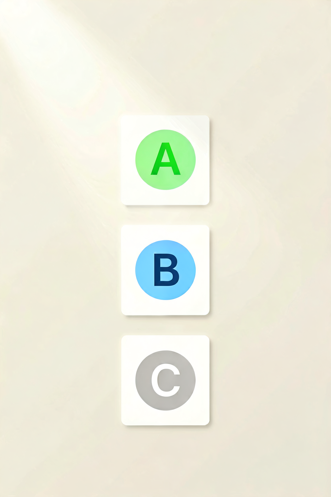
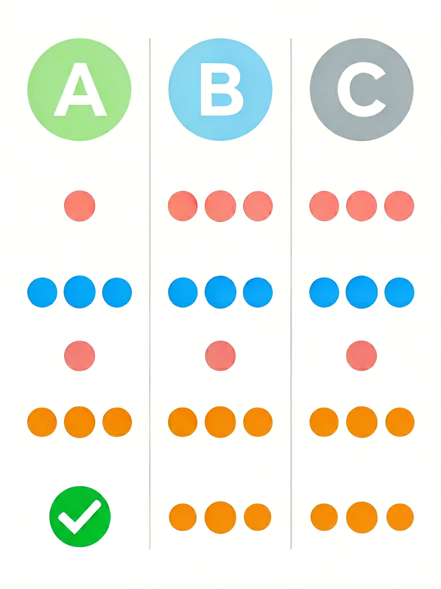

# 面料安全类别速查：A 类、B 类、C 类到底有什么区别？



> **开篇**
>
> 你买过那种"外贸原单"的衣服吗？没有标签，没有成分说明，但价格便宜，摸起来手感也不错。
>
> 你可能不知道的是：**合格的服装标签上必须标注"安全类别"——A 类、B 类、C 类——这是国家强制标准，决定了这件衣服的甲醛含量、pH 值、色牢度是否达标。**
>
> 没有安全类别标注的衣服，就像没有生产日期的食品——你不知道它安不安全。
>
> 这篇文章帮你搞清楚：**A 类、B 类、C 类分别代表什么，买衣服时应该怎么选。**

---

## 安全类别是什么？

安全类别是 **GB 18401-2010《国家纺织产品基本安全技术规范》** 规定的强制性分类标准。所有在中国销售的服装，**必须标注安全类别**，否则属于不合格产品。

这个标准从三个维度控制服装的安全性：

| 安全指标 | 检测什么 | 为什么重要 |
|---------|---------|-----------|
| **甲醛含量** | 面料中残留的甲醛量 | 甲醛刺激皮肤，长期接触可能致癌 |
| **pH 值** | 面料的酸碱度 | 人体皮肤呈弱酸性（pH 5.5-6.5），过酸或过碱刺激皮肤 |
| **色牢度** | 颜色是否容易脱落 | 掉色染到皮肤上可能引起过敏 |
| **异味** | 是否有霉味、汽油味等 | 异味说明化学物质残留 |
| **可分解致癌芳香胺染料** | 是否使用了禁用染料 | 某些染料会分解出致癌物 |

---

## 三类安全标准对比



| 项目 | **A 类（婴幼儿）** | **B 类（直接接触皮肤）** | **C 类（非直接接触皮肤）** |
|:----|:-----------------:|:----------------------:|:------------------------:|
| **甲醛含量** | ≤ 20 mg/kg | ≤ 75 mg/kg | ≤ 300 mg/kg |
| **pH 值** | 4.0-7.5 | 4.0-8.5 | 4.0-9.0 |
| **耐水色牢度** | ≥ 4 级 | ≥ 3 级 | ≥ 3 级 |
| **耐汗渍色牢度** | ≥ 4 级 | ≥ 3 级 | ≥ 3 级 |
| **耐干摩擦色牢度** | ≥ 4 级 | ≥ 3 级 | ≥ 3 级 |
| **异味** | 无 | 无 | 无 |
| **禁用染料** | 不得检出 | 不得检出 | 不得检出 |

**关键数字：**
- A 类的甲醛上限是 **20 mg/kg**——相当于 C 类（300 mg/kg）的 1/15
- B 类的甲醛上限是 **75 mg/kg**——相当于 C 类的 1/4
- pH 值范围从 A 类到 C 类逐步放宽

---

## 分别适用于什么产品

### A 类——婴幼儿用品

**适用对象：** 36 个月及以下的婴幼儿

**适用产品：**
- 婴幼儿内衣、尿布、睡衣
- 婴幼儿外套、帽子、袜子
- 婴幼儿床上用品
- 婴儿毛巾、口水巾

**选购要点：**
- 婴幼儿服装 **必须** 标注 A 类，否则不能销售
- A 类的标签上通常会额外标注"婴幼儿用品"字样
- 即使是 A 类，**新衣服也要先洗再穿**（洗掉生产过程中的残留物）

### B 类——直接接触皮肤的产品

**适用对象：** 直接与皮肤接触的服装

**适用产品：**
| 品类 | 示例 |
|:----|:-----|
| 内衣 | 文胸、内裤、秋衣秋裤 |
| 贴身衣物 | T 恤、衬衫、背心 |
| 下装 | 短裤、裙子（不穿里衬时） |
| 袜子 | 所有袜子 |
| 床上用品 | 床单、被套、枕套 |
| 毛巾 | 浴巾、面巾 |

**选购要点：**
- 以上品类的标签必须标注 **B 类** 或以上（A 类也可以）
- 如果标注的是 C 类，说明这件衣服**不适合直接接触皮肤**
- 特别是**内衣和袜子**，一定买 B 类以上的

### C 类——非直接接触皮肤的产品

**适用对象：** 不直接接触皮肤，或仅部分接触皮肤的外穿衣物

**适用产品：**
| 品类 | 示例 |
|:----|:-----|
| 外套 | 夹克、风衣、大衣、羽绒服 |
| 西装 | 西服上衣、西裤（有里衬） |
| 特殊外衣 | 雨衣、防护服 |
| 家用纺织品 | 窗帘、桌布、墙布 |

**选购要点：**
- C 类产品**不是不安全**，而是它的使用场景不需要那么高的标准
- 外套买 C 类完全正常，但**领口、袖口内里如果有直接接触皮肤的部分，应该是 B 类以上**
- 有些高端外套会标注 B 类，这是加分项，但不是必须的

---

## 如何快速判断

| 产品类型 | 应选类别 | 如果标了 C 类 |
|---------|:--------:|:------------:|
| 婴儿连体衣 | **A 类** | 不合格，不能买 |
| 纯棉 T 恤 | **B 类** | 不适合贴身穿 |
| 运动短裤 | **B 类** | 不适合贴身穿 |
| 羽绒服 | **C 类** | 正常，可以穿 |
| 西装外套 | **C 类** | 正常，可以穿 |
| 床单被套 | **B 类** | 不适合贴肤使用 |
| 袜子 | **B 类** | 不合格，不能买 |

---

## 常见误区

### 误区 1：「C 类是有毒的，不能穿」

C 类的甲醛上限是 300 mg/kg，远低于对人体有害的剂量。**C 类外套是安全的，不需要担心。** 真正需要警惕的是**没有标注安全类别**的衣服，因为你不知道它达到什么标准。

### 误区 2：「A 类比 B 类好，所以买 A 类的衣服更安全」

A 类是为婴幼儿设计的，对甲醛和 pH 值的要求最严格。但成人穿 A 类衣服没有额外好处——**B 类对成人来说已经足够安全**，A 类也不会让成年人更健康。选对类别比选更严的类别更重要。

### 误区 3：「没有标签的外贸原单质量更好」

没有安全类别标签的服装，**无法确认是否达到 B 类或 C 类标准**。甲醛超标、pH 值偏酸偏碱、色牢度不够——这些是看不到的隐患。所谓的"原单""尾货"没有标签，意味着它可能根本没经过检测。

### 误区 4：「深色衣服掉色是质量问题，和类别无关」

掉色和色牢度有关。**色牢度是安全类别的一个重要指标。** B 类以上的衣服色牢度至少达到 3 级，正常洗涤不会明显掉色。如果一件深色衣服洗一次就掉色严重，说明它的色牢度可能不达标。

---

## 决策清单

买衣服时，按这个顺序检查安全类别：

```
1. 找标签上的安全类别
   → 看有没有"安全类别：A类/B类/C类"字样
   → 没有标注 → 不合格产品，谨慎购买

2. 判断是否匹配
   → 婴幼儿 → 必须 A 类
   → 内衣/T恤/袜子 → 必须 B 类以上
   → 外套 → C 类即可

3. 检查新衣服
   → 新衣服买回来先洗再穿
   → 洗的时候如果有刺鼻气味，说明甲醛可能超标
   → 如果洗后掉色严重，说明色牢度可能不达标

4. 特别留意
   → 网购时看清详情页的安全类别标注
   → 促销打折的"特价处理"衣服也要有标签
   → 婴幼儿衣服不要买二手，来源不明
```

---

> **一句话总结：** 安全类别是服装的"食品保质期"——A 类给婴幼儿，B 类贴身穿，C 类穿外面。**不标注安全类别的衣服，就像没有生产日期的食品，建议不要买。**

---

> 参考来源：GB 18401-2010《国家纺织产品基本安全技术规范》；GB/T 5296.4-2012《消费品使用说明 第4部分：纺织品和服装》
> 最后更新：2026-07-31