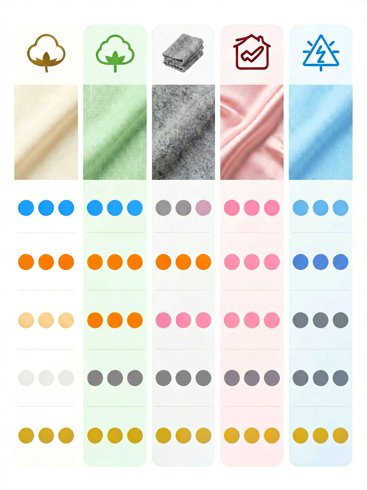

# 常见面料综合评价速查表：30 种面料，一张表说清楚


> **开篇**
>
> 你站在衣架前，翻出一件衣服看标签：棉 100%。又翻一件：聚酯纤维 100%。再翻一件：黏胶 70%，聚酯纤维 30%。
>
> 你可能知道棉舒服、聚酯纤维耐穿，但**具体到每种面料，透气性到底差多少？保暖性排名？价格区间？环保性？**
>
> 这篇文章就是一张**参考表**——不是让你背下来，而是当你面对一件衣服时，知道它的面料大概在什么水平。

---

## 一张表看全所有面料



表中数据基于典型面料（中等厚度/常见织法），实际效果因纱线支数、织法、后整理工艺而异。

### 天然纤维

| 面料 | 透气性 | 保暖性 | 柔软度 | 弹性 | 耐磨 | 易护理 | 价格 | 环保 |
|:----|:-----:|:-----:|:-----:|:---:|:---:|:-----:|:---:|:---:|
| **普通棉** | ★★★★ | ★★ | ★★★★ | ★ | ★★★ | ★★★★ | 低 | ★★★★ |
| **长绒棉** | ★★★★ | ★★ | ★★★★★ | ★ | ★★★★ | ★★★★ | 中 | ★★★★ |
| **亚麻** | ★★★★★ | ★ | ★★ | ★ | ★★★★ | ★★★ | 中 | ★★★★★ |
| **苎麻** | ★★★★★ | ★ | ★★ | ★ | ★★★★ | ★★★ | 中 | ★★★★★ |
| **普通羊毛** | ★★★ | ★★★★ | ★★★ | ★★ | ★★★ | ★★ | 中 | ★★★★ |
| **美利奴羊毛** | ★★★★ | ★★★★ | ★★★★ | ★★★ | ★★★ | ★★ | 中高 | ★★★★ |
| **羊绒** | ★★★★ | ★★★★★★ | ★★★★★ | ★★★ | ★★ | ★★ | 高 | ★★★★ |
| **真丝（桑蚕丝）** | ★★★ | ★★ | ★★★★★ | ★ | ★★ | ★ | 中高 | ★★★ |
| **驼绒** | ★★★★ | ★★★★★ | ★★★★ | ★★★ | ★★★ | ★★ | 高 | ★★★★ |
| **马海毛** | ★★★★ | ★★★★ | ★★★ | ★★★ | ★★ | ★★ | 中高 | ★★★★ |

### 合成纤维

| 面料 | 透气性 | 保暖性 | 柔软度 | 弹性 | 耐磨 | 易护理 | 价格 | 环保 |
|:----|:-----:|:-----:|:-----:|:---:|:---:|:-----:|:---:|:---:|
| **聚酯纤维（涤纶）** | ★★ | ★★★ | ★★ | ★★★ | ★★★★ | ★★★★★ | 低 | ★★ |
| **尼龙（锦纶）** | ★★★ | ★★★ | ★★★ | ★★★★★ | ★★★★★ | ★★★★ | 中 | ★★ |
| **氨纶（弹性纤维）** | ★★ | ★★ | ★★★ | ★★★★★★★ | ★★ | ★★★ | 中 | ★★ |
| **腈纶** | ★★★ | ★★★ | ★★★ | ★★ | ★★★ | ★★★★ | 低 | ★★ |
| **丙纶** | ★★★★ | ★★★ | ★★ | ★★★ | ★★★ | ★★ | 中 | ★★★ |

### 再生纤维

| 面料 | 透气性 | 保暖性 | 柔软度 | 弹性 | 耐磨 | 易护理 | 价格 | 环保 |
|:----|:-----:|:-----:|:-----:|:---:|:---:|:-----:|:---:|:---:|
| **黏胶纤维（人造丝）** | ★★★★ | ★★ | ★★★★ | ★ | ★★ | ★★ | 低 | ★★★ |
| **莫代尔** | ★★★★★ | ★★ | ★★★★★ | ★★ | ★★★ | ★★★ | 中 | ★★★★ |
| **天丝（莱赛尔纤维）** | ★★★★★ | ★★ | ★★★★★ | ★★ | ★★★★ | ★★★★ | 中高 | ★★★★★ |
| **铜氨纤维** | ★★★★ | ★★ | ★★★★★ | ★ | ★★ | ★★★ | 中高 | ★★★★ |
| **醋酸纤维** | ★★ | ★ | ★★★★ | ★ | ★ | ★★ | 中 | ★★★ |
| **竹纤维（竹浆黏胶）** | ★★★★ | ★★ | ★★★★ | ★ | ★★ | ★★★ | 中 | ★★★★ |

### 常见混纺

| 混纺类型 | 特点 | 适合场景 | 护理难度 |
|:---------|:----|:--------|:--------:|
| **棉 65% + 聚酯 35%** | 棉的舒适+聚酯的不易皱 | 日常通勤衬衫 | 低 |
| **棉 95% + 氨纶 5%** | 棉的舒适+弹性 | T恤、牛仔裤 | 低 |
| **羊毛 70% + 尼龙 30%** | 羊毛的质感+尼龙的耐磨 | 西装、大衣 | 中 |
| **黏胶 70% + 聚酯 30%** | 丝滑手感+耐用 | 连衣裙、衬衫 | 中 |
| **棉 50% + 莫代尔 50%** | 柔软+挺括平衡 | 家居服、T恤 | 低 |
| **聚酯 90% + 氨纶 10%** | 速干+弹性 | 运动服、瑜伽裤 | 低 |
| **羊毛 50% + 腈纶 50%** | 保暖+低成本 | 平价毛衣 | 中 |

---

## 按性能指标排序

### 透气性 Top 5

| 排名 | 面料 | 说明 |
|:---:|:----|:----|
| 1 | **亚麻** | 天然纤维中透气性最好 |
| 2 | **苎麻** | 比亚麻稍硬，透气性同样优秀 |
| 3 | **莫代尔** | 再生纤维中透气性最好 |
| 4 | **天丝** | 透气+凉感，夏天首选 |
| 5 | **棉** | 日常透气性标杆 |

### 保暖性 Top 5

| 排名 | 面料 | 说明 |
|:---:|:----|:----|
| 1 | **羊绒** | 保暖性是羊毛的 1.5-2 倍 |
| 2 | **驼绒** | 比羊绒更轻更暖 |
| 3 | **羊毛** | 经典保暖材料 |
| 4 | **腈纶** | 平价保暖选择 |
| 5 | **聚酯纤维（中空）** | 科技保暖棉的原料 |

### 柔软度 Top 5

| 排名 | 面料 | 说明 |
|:---:|:----|:----|
| 1 | **羊绒** | 14-16μm，极细极软 |
| 2 | **真丝** | 最光滑的天然纤维 |
| 3 | **莫代尔** | 比棉更软，比真丝便宜 |
| 4 | **天丝** | 丝滑感，有凉感 |
| 5 | **长绒棉** | 棉中的柔软天花板 |

### 耐磨性 Top 5

| 排名 | 面料 | 说明 |
|:---:|:----|:----|
| 1 | **尼龙** | 最耐磨的服装纤维 |
| 2 | **聚酯纤维** | 耐磨性仅次于尼龙 |
| 3 | **亚麻** | 湿态下强度反而增加 |
| 4 | **天丝** | 干湿强度都高 |
| 5 | **长绒棉** | 长纤维不易断裂 |

### 环保性 Top 5

| 排名 | 面料 | 说明 |
|:---:|:----|:----|
| 1 | **亚麻/苎麻** | 种植需水少，无需农药 |
| 2 | **天丝** | 闭环工艺，溶剂回收率 99%+ |
| 3 | **有机棉** | 无农药种植 |
| 4 | **莫代尔** | 可持续木材来源 |
| 5 | **羊毛/羊绒** | 可生物降解 |

---

## 常见误区

### 误区 1：「面料越贵越好」

价格和品质不完全正相关。**亚麻比棉贵，但不如棉耐用；真丝比莫代尔贵，但护理难度大得多。** 选面料不是选最贵的，而是选最符合你使用场景的。

### 误区 2：「纯天然一定比化纤好」

纯天然面料在舒适度上有优势，但在**功能性上往往不如化纤**。运动时穿纯棉不如聚酯纤维，冬天穿腈纶毛衣比羊毛便宜且好打理。**天然和化纤各有各的战场，没有绝对的高下。**

### 误区 3：「面料越厚越好」

厚度不等于品质。**高支数的薄面料可能比低支数的厚面料更贵、更耐用。** 面料的品质取决于纤维长度、纱线支数、织法密度，而不是厚度。

### 误区 4：「起球的面料就是质量差」

起球是短纤维摩擦后的自然现象。**羊毛、羊绒、腈纶都容易起球，但这不影响它们的保暖性和舒适度。** 真正的问题不是起球，而是起球后纤维是否断裂。好的面料起球后修剪即可恢复，差的面料起球后直接秃了。

---

## 参考用法

```
面对一件衣服，不知道怎么判断面料好坏时：

1. 翻标签看成分
   → 纯棉/纯羊毛/纯真丝：品质有保障，看护理难度
   → 混纺：看比例是否合理，主要成分是什么
   → 纯化纤：看用途是否匹配（运动服ok，西装一般）

2. 对照上表看性能
   → 透气性够吗？→ 看透气性排名
   → 保暖性够吗？→ 看保暖性排名
   → 好打理吗？→ 看易护理评分

3. 结合价格判断
   → 价格远低于市场均价 → 面料可能有问题
   → 价格合理 → 正常购买
   → 价格远高于市场均价 → 贵的可能是设计/品牌，不是面料
```

---

> **一句话总结：** 没有完美的面料，只有最适合你的面料。**这张表不是让你背的，是当你拿不准的时候，翻出来看一眼用的。**

---

> 参考来源：GB/T 29862-2013《纺织品 纤维含量的标识》；GB/T 4146.1-2020《纺织品 化学纤维 第1部分：通用术语》；Lenzing AG 纤维技术资料；The Woolmark Company 标准
> 最后更新：2026-07-31