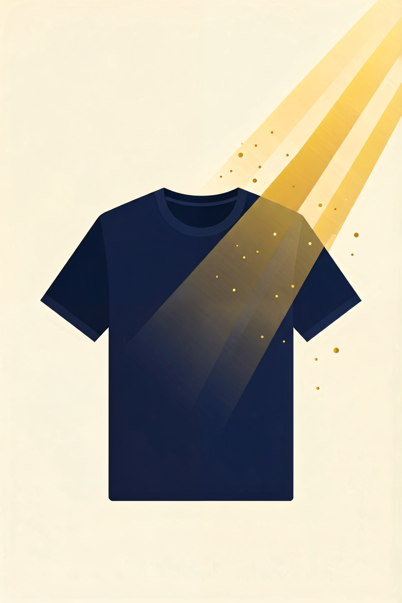
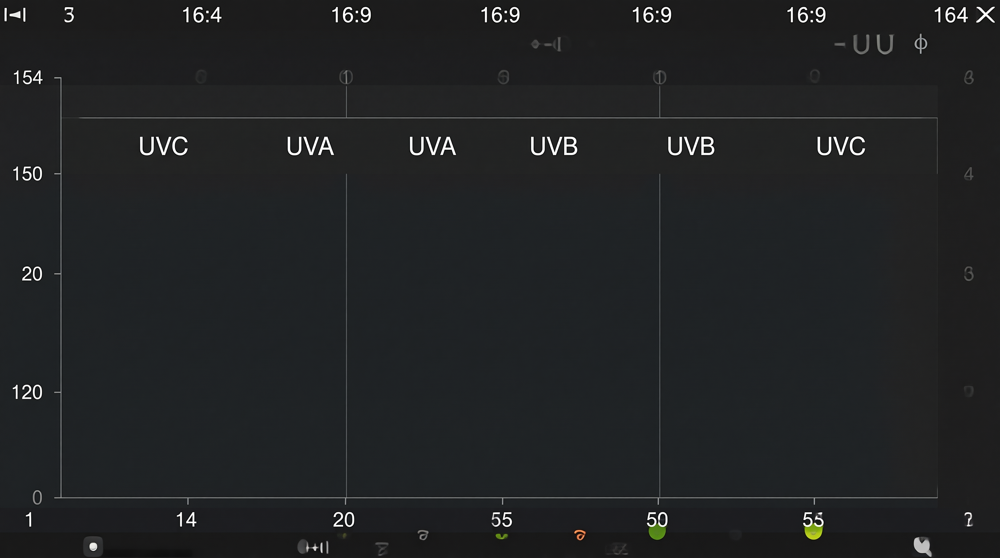
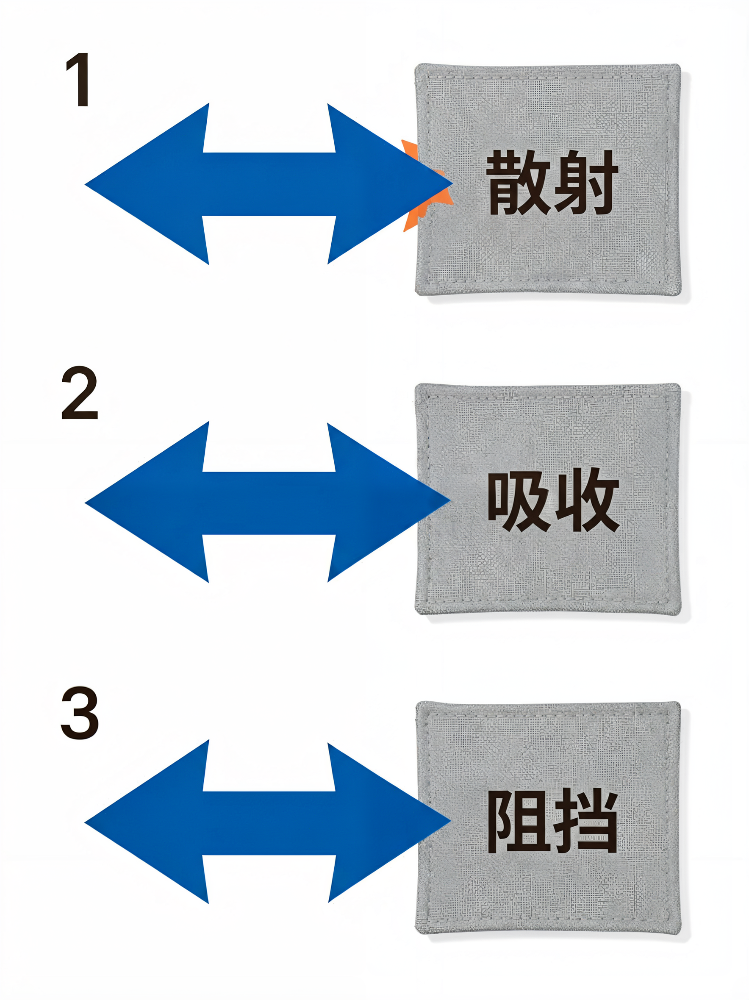
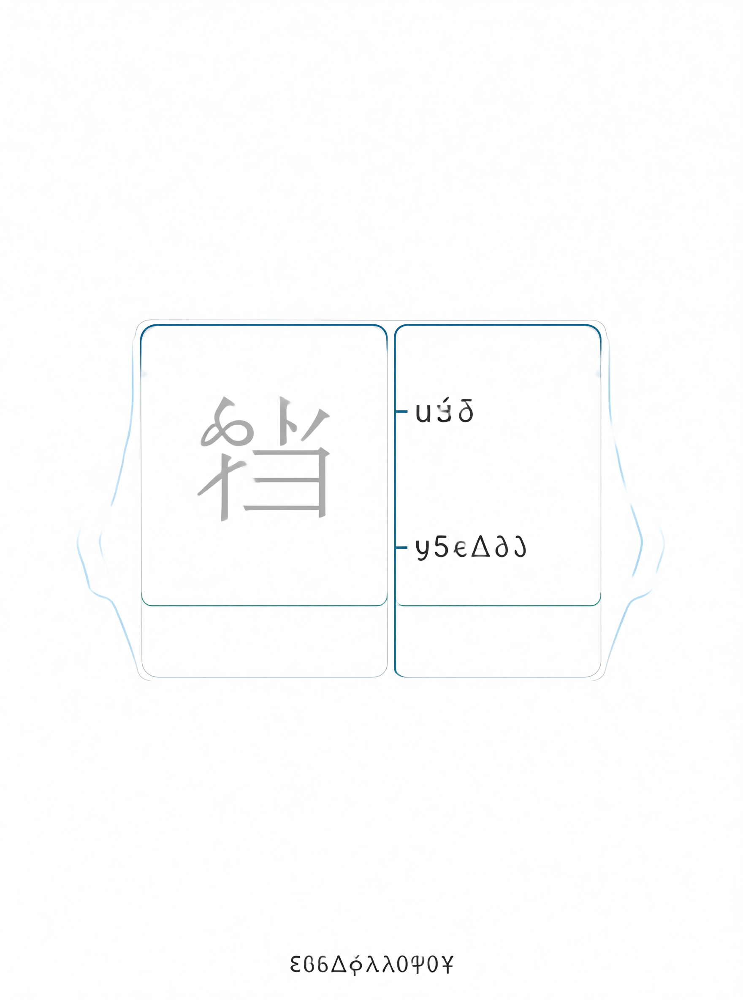

# 防晒衣的面料真相：为什么有些防晒衣效果可能不如普通 T 恤





> **开篇**
>
> 每年夏天，防晒产品市场都是最火的品类。防晒衣、防晒伞、防晒口罩、防晒袖套……广告铺天盖地，价格从几十到几百不等。
>
> 但你可能没有想过：**一件普通的深色 T 恤，防晒效果可能比一件几百块的"防晒衣"还要好。**
>
> 这看起来有点反直觉，但事实如此——决定防晒效果的，不是价格，而是面料本身。
>
> 这篇文章，我们只讲一件事：**怎么选面料，才能让衣服真正帮你挡住紫外线**。不推荐任何品牌，不接广告，只讲面料的物理学。

---

## 第一部分：紫外线到底是什么？

### 三种紫外线，哪种最伤人？

太阳射向地球的光线中，紫外线（UV）占约 10%，但就是这 10%，造成了皮肤晒黑、晒伤、光老化，甚至皮肤癌。紫外线按波长分为三类：

| 类型 | 波长范围 | 能穿透大气层吗？ | 对皮肤的伤害 |
|------|---------|---------------|-------------|
| **UVA** | 320-400nm | 绝大部分（约 95%） | 穿透到真皮层，造成光老化、皱纹、色斑；可穿透玻璃 |
| **UVB** | 280-320nm | 约 5% | 灼伤表皮，引起晒红、晒伤、脱皮；主要作用在白天 10 点-16 点 |
| **UVC** | 100-280nm | 极少 | 几乎被臭氧层完全阻挡，一般不在讨论范围内 |

日常防护真正需要警惕的是 **UVA**——它穿透力强，可以穿透玻璃，阴天、室内靠近窗户时依然存在。大部分防晒讨论只关注"晒伤"（UVB），却忽略了"晒老"（UVA），这正是很多人没意识到的地方。

### UVB 的"黄金两小时"

UVB 在**上午 10 点到下午 4 点**之间最强，这段时间紫外线强度是上午 8 点的 4-5 倍。在这两小时内长时间暴露在阳光下，哪怕穿了一件普通 T 恤，皮肤也会累积大量紫外线暴露。

---

## 第二部分：面料是怎么挡住紫外线的？

### 三个物理原理

面料防晒不是靠"涂了防晒霜"，而是靠三个物理机制：

**1. 散射（Scattering）**
纱线之间不规则排列，让紫外线在织物内部多次反射、散射，最终大部分被反弹出去。织得越密，散射越强。

**2. 吸收（Absorption）**
纤维本身吸收紫外线——纤维的化学结构决定了它能吸收多少紫外线。天然纤维（棉、羊毛）本身有较弱的吸收能力；合成纤维（尼龙、聚酯纤维）吸收能力更强。

**3. 反射（Reflection）**
面料表面的反光性也能阻挡一部分紫外线。深色面料反光率低、吸收率高，看起来"吸收"了紫外线——其实是把紫外线拦截在了面料层，不让其穿透到皮肤。



### 防晒效果由什么决定？

| 优先级 | 因素 | 对防晒的影响 |
|--------|------|-------------|
| **最高** | 织物密度（每平方米纱线根数） | 密度越大，紫外线穿透越少 |
| **高** | 面料颜色（深色 > 浅色） | 深色比浅色多吸收 30-50% 的紫外线 |
| **中高** | 纤维种类（聚酯纤维 > 棉 > 亚麻） | 合成纤维吸收紫外线能力更强 |
| **中** | 面料厚度（克重） | 越厚穿透越少，但影响透气性 |
| **中** | 面料表面处理（涂层、后整理） | 部分防晒面料有特殊后整理工艺 |

简单说：一件深色、密实的聚酯纤维 T 恤，防晒效果超过一件宽松的白色亚麻衬衫——即使亚麻看起来"布料更厚"。

---

## 第三部分：各面料防晒能力对比

以下数据基于常见织物密度的典型产品，实际效果因织法而异：

| 面料 | 典型 UPF 值 | UVA 穿透率 | 评价 |
|------|-----------|-----------|------|
| **紧密编织的聚酯纤维** | UPF 30-50+ | 5-10% | 日常面料中效果最好的 |
| **紧密编织的尼龙** | UPF 30-50+ | 5-10% | 与聚酯纤维同级 |
| **深色纯棉（密织）** | UPF 15-25 | 15-30% | 日常够用 |
| **浅色纯棉（密织）** | UPF 5-10 | 30-50% | 基本不防晒 |
| **浅色亚麻** | UPF 2-5 | 50-80% | 几乎不防晒 |
| **真丝（普通）** | UPF 1-3 | 80-95% | 基本不防晒 |
| **通过 UPF 50+ 认证的专业防晒面料** | UPF 50+ | < 2% | 效果最好，但并非必要 |



### UPF 是什么意思？

UPF（Ultraviolet Protection Factor）是面料防晒的衡量指标，和防晒霜的 SPF 类似：

- **UPF 15**：阻挡 93.3% 的紫外线
- **UPF 25**：阻挡 96% 的紫外线
- **UPF 35**：阻挡 97.1% 的紫外线
- **UPF 50+**：阻挡 98% 以上的紫外线

澳大利亚和新西兰的 AS/NZS 4399 标准规定：UPF ≥ 15 才能标注"防晒"；UPF ≥ 40 才能标注"高防晒"；UPF ≥ 50+ 才能标注"极端防晒"。

### 为什么亚麻看起来最透气，防晒却最差？

亚麻的透气性好是因为它的**纱线间距大**——这恰恰也是防晒能力差的原因。紫外线不需要"穿透"纤维本身，只需要从纱线之间的空隙通过。织得越松散，空隙越大，紫外线通过越容易。

透气性好的面料，防晒效果通常更差。这是夏天防晒最大的矛盾——想凉快又想防晒，两者天然矛盾。

---

## 第四部分：颜色，比面料更关键

### 深色为什么防晒更好？

深色面料的染料分子吸收紫外线的能力更强。一件深蓝色的聚酯纤维 T 恤，对紫外线的阻挡率可能比白色同款高 40-60%。

**颜色防晒排序（同一面料下）：**

深色（黑、深蓝、深红） > 中色（灰、棕） > 浅色（白、米色、浅蓝）

### 但深色有代价

深色面料吸收紫外线也意味着它**吸收可见光**——所以深色衣服在太阳下会比浅色衣服温度更高，体感更热。

| 颜色 | 防晒效果 | 体感温度（同面料） | 综合评价 |
|------|---------|----------------|---------|
| 黑色 | 最高 | 最高 | 防晒但不凉快 |
| 深蓝 | 高 | 高 | 防晒效果接近黑色，体感稍好 |
| 灰色 | 中高 | 中 | 两者之间的平衡 |
| 白色 | 最低 | 最低 | 凉快但几乎不防晒 |

夏天日常出行，深蓝、深灰是兼顾防晒和体感的比较合适的选择。纯黑色防晒最好，但在烈日下体感温度明显偏高。

---

## 第五部分：湿了以后，防晒变了

这是一个很多人不知道的冷知识：**湿了的衣服防晒能力反而提升。**

原理是：面料吸水后，纤维膨胀，纱线之间的孔隙变小，紫外线更难穿透。一件湿透的白色棉 T 恤，防晒能力反而比干的时候好。

但这里有个前提：**湿衣服防晒提升的前提是衣服真的湿了**。如果只是出汗（汗液在皮肤表面，没有真正浸透衣服），防晒效果不会提升。

---

## 第六部分：分场景看防晒

### 日常通勤（办公室 + 室外通勤）

| 衣服类型 | 防晒效果 | 说明 |
|---------|---------|------|
| 普通纯棉 T 恤（浅色） | 弱 | 单独穿不防晒，需要配合遮阳帽或遮阳伞 |
| 纯棉 T 恤（深色） | 中 | 可以，但不是效果最好的选择 |
| 聚酯纤维 T 恤（深色） | 好 | 日常优先考虑的面料和颜色 |
| 长袖衬衫（密织棉） | 好 | 防晒 + 凉快，适合有空调的室内 |
| 通过 UPF 50+ 认证的专业防晒衣 | 最好 | 长时间户外时是有效的选择 |

### 长时间户外（旅游、户外工作、运动）

| 衣服类型 | 防晒效果 | 说明 |
|---------|---------|------|
| 普通短袖 | 不够 | 紫外线暴露过多，不建议长时间穿着 |
| 防晒衣（UPF 50+，深色） | 优 | 长时间户外的建议穿着 |
| 防晒袖套 | 补充 | 配合长袖使用效果更佳 |
| 遮阳帽 + 长袖 | 优 | 提供全身防护 |
| 经过 UPF 认证的专业户外防晒服装 | 优 | 价格较高，但防晒性能有数据支撑 |

> 长时间户外（超过 30 分钟）：建议穿着防晒衣或长袖，并配合遮阳帽和墨镜。防晒霜是辅助，不是主力防护手段。

### 开车

很多人不知道：**车窗玻璃不能完全阻挡 UVA。** 普通车窗玻璃能阻挡 UVB（约 95%），但对 UVA 的阻挡率只有约 30-40%。这意味着开车时，手臂和腿部皮肤仍然在累积 UVA 暴露。

| 场景 | 防晒措施 |
|------|---------|
| 短途开车（< 30 分钟） | 长袖或防晒袖套 |
| 长途开车 | 长袖防晒衣 + 防晒袖套 + 墨镜 |

### 室内

**隔着玻璃防晒吗？** 玻璃阻挡 UVB，但不阻挡 UVA。如果靠窗坐一整天，UVA 仍然在累积。长期靠窗坐的人，面部和手臂可能出现"车内/车外肤色不均"的现象。

---

## 第七部分：专业防晒衣怎么选？贵的和便宜的有什么差别？

### 防晒衣的核心指标

| 指标 | 含义 |
|------|------|
| **UPF 50+** | 阻挡 98% 以上紫外线，这是有效防晒的最低门槛 |
| **UVA 穿透率 < 5%** | 比 UPF 更严格，部分产品会单独标注 |
| **透气性** | 防晒衣最大的矛盾——防紫外线 vs 透气散热 |
| **面料材质** | 聚酯纤维或尼龙面料通常含紫外线吸收剂 |

### 贵的防晒衣和便宜的防晒衣，区别在哪？

| 维度 | 几十块的"防晒衣" | 几百块的专业防晒衣 |
|------|----------------|------------------|
| UPF 值 | 部分标注 50+，实际可能不达标 | UPF 50+ 认证，数据可查证 |
| 透气性 | 普通，穿起来闷 | 透气技术更成熟，体感更好 |
| 耐久度 | 洗几次后防晒效果可能下降 | 经过多次洗涤测试，效果更稳定 |
| 做工 | 拉链、走线一般 | 做工更细致 |

可以这样理解：如果你只是日常出门，一件深色聚酯纤维 T 恤就够用了。如果长时间在户外（徒步、骑行、海边），一件有 UPF 50+ 认证的专业防晒衣，是有效的选择。

---

## 第八部分：购买防晒衣的决策清单

当你站在货架前或刷电商页面时，按这个顺序判断：

```
1. 先看 UPF 标识
   → 没有标注 UPF 的防晒衣，谨慎对待
   → UPF < 35 的防晒衣，防晒效果有限

2. 看面料成分
   → 聚酯纤维 / 尼龙面料的防晒性能通常更好
   → 纯亚麻 / 真丝面料，防晒效果较弱

3. 看颜色
   → 深色面料 > 浅色面料（同一面料下）

4. 看袖长
   → 长袖 > 短袖（遮盖面积决定防晒总量）

5. 看透气性标注
   → 有"透气""吸湿速干"等标注的产品，体感更好

6. 看价格
   → 几十块的看 UPF 认证
   → 几百块的看透气技术
   → 预算有限时，深色聚酯纤维 T 恤是可行的替代方案
```

---

## 第九部分：常见防晒误区

### 误区 1：「穿了防晒衣就不需要防晒霜」

防晒衣保护的是被遮盖的皮肤，但脸部、脖子、手腕、脚踝这些暴露部位仍然需要防晒霜。防晒衣和防晒霜配合使用，才是完整的防护。

### 误区 2：「阴天不用防晒」

阴天的紫外线强度可以降到晴天的 50-60%，但 UVA 依然很强。长时间在阴天户外，同样会累积紫外线暴露。

### 误区 3：「防晒霜涂了就够了，不用遮衣服」

防晒霜涂抹不均匀是常态，实际保护率通常只有标注数值的 50-70%。物理遮挡（衣服、帽子、伞）是第一道防线，防晒霜是第二道。

### 误区 4：「防晒衣越贵防晒效果越好」

贵的是透气技术和做工，不是防晒本身。一件深色密织聚酯纤维 T 恤，防晒效果可能超过一件贵但材质一般的防晒衣。

### 误区 5：「浅色比深色防晒好」

深色面料对紫外线的吸收率比浅色高 30-60%。浅色凉快但防晒差，深色防晒好但体感热。深蓝、深灰是两者之间比较折中的选择。

---

## 总结：防晒面料的核心法则

| 法则 | 说明 |
|------|------|
| **密 > 厚** | 织物密度比厚度更重要——一件密织的薄面料，防晒效果超过一件厚但稀疏的面料 |
| **深 > 浅** | 颜色是第一道防线，深色比浅色多挡 30-60% 紫外线 |
| **聚酯纤维 > 棉 > 亚麻** | 合成纤维对紫外线吸收能力更强 |
| **长袖 > 短袖** | 遮盖面积决定防晒总量 |
| **认证 > 广告** | 看 UPF 数值，不看品牌 logo |

简单说就是：夏天防晒，第一道防线是穿对衣服，第二道防线才是涂防晒霜。选一件深色、密织、聚酯纤维的长袖 T 恤，成本几十块，防晒效果可能超过几百块的"防晒神器"。

---

> 下一篇文章，我们讲**运动面料**——为什么健身房里没人穿纯棉？

---

- 参考来源：GB/T 29862-2013《纺织品 纤维含量的标识》；AS/NZS 4399-2017《太阳辐射防护 纺织品日光防护方法》；《中国光生物学与皮肤医学指南》
- 最后更新：2026-07-31
