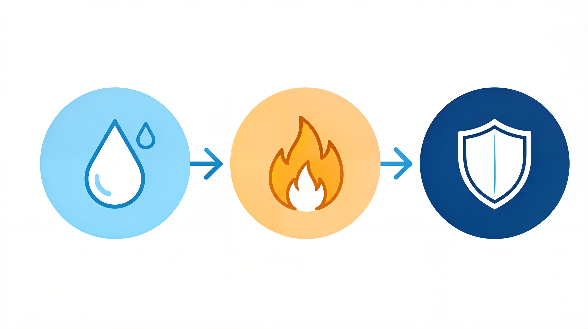

# 户外运动面料指南：速干、防水、防风、透气——户外服装的面料真相


> **开篇**
>
> 你穿着一件普通的棉 T 恤去爬山，刚走半小时，衣服就湿透了，贴在身上又冷又重。
>
> 而旁边的人穿了一件看起来差不多的长袖，却干干爽爽。
>
> 这不是体质问题，是**面料问题**。棉在户外场景中可以说是最差的选择——它吸水、不干、湿了之后不保暖。而户外运动面料的设计逻辑，恰好和日常服装相反：**不是追求舒适，而是追求"湿了之后依然舒适"**。
>
> 这篇文章不讲品牌，只讲面料原理：**速干、防水、防风、透气，这些功能到底是怎么实现的，怎么选才不花冤枉钱。**

---

## 户外着装的底层逻辑：三层穿衣法



户外运动的面料选择，遵循一个基本原则——**三层穿衣法**。这不是穿三件衣服，而是通过三个功能层来管理身体的热量和湿气：

| 层级 | 功能 | 对应面料 | 常见单品 |
|:----|:----|:---------|:---------|
| **基础层（Base Layer）** | 排汗——把汗水从皮肤表面带走 | 美利奴羊毛、丙纶、聚酯纤维 | 速干内衣、保暖内衣 |
| **中间层（Mid Layer）** | 保暖——锁住身体热量 | 抓绒、羽绒、羊毛 | 抓绒衣、轻薄羽绒服 |
| **外层（Shell Layer）** | 防护——防风、防水、耐磨 | 尼龙、聚酯纤维（带防水膜） | 冲锋衣、软壳 |

**核心逻辑：** 汗水从基础层→中间层→外层逐层排出，同时外层阻挡风和雨。**任何一层选错了，整个系统都会失效。**

---

## 基础层（Base Layer）：排汗才是第一要务

基础层直接接触皮肤，它的唯一任务是**把汗水从皮肤表面带走，不让汗水留在皮肤上**。

### 基础层的面料选择

| 面料 | 排汗速度 | 保暖性 | 防臭 | 舒适度 | 适合场景 |
|:----|:-------:|:-----:|:---:|:-----:|:--------|
| **聚酯纤维** | ★★★★ | ★★ | ★★ | ★★★ | 夏季徒步、跑步 |
| **丙纶** | ★★★★★ | ★★ | ★★★★★ | ★★ | 高强度运动、多日徒步 |
| **美利奴羊毛** | ★★★ | ★★★★ | ★★★★★ | ★★★★ | 秋冬徒步、露营、滑雪 |
| **尼龙** | ★★★ | ★★★ | ★★★ | ★★★★ | 瑜伽、低强度运动 |
| **棉** | ★ | ★ | ★ | ★★★★ | ❌ 不适合户外 |

**为什么棉在户外是灾难：**
- 棉纤维吸水后会膨胀，堵塞面料孔隙，**湿了之后不透气**
- 棉的干燥速度是聚酯纤维的 **5-10 倍**
- 湿棉贴在皮肤上，在冷风中会迅速带走体温，**有失温风险**

> **选购要点：** 夏季户外运动选聚酯纤维基础层，价格低、排汗快。秋冬户外运动选美利奴羊毛基础层，排汗+保暖+防臭，一件可以穿 3-5 天不臭。

### 基础层的重量选择

基础层按重量（厚度）分为三个等级：

| 等级 | 克重（g/m²） | 适合温度 | 适合场景 |
|:----|:-----------:|:--------:|:--------|
| **轻量** | 150-180 | 15℃以上 | 夏季徒步、跑步 |
| **中量** | 200-230 | 5-15℃ | 春秋徒步、滑雪 |
| **重量** | 250-280 | -5-5℃ | 冬季徒步、高海拔 |

---

## 中间层（Mid Layer）：锁住热量

中间层的任务是在基础层排汗的基础上，**锁住身体产生的热量**。保温的原理不是"发热"，而是**在面料内部制造静止空气层**，阻止热量散失。

### 抓绒——最常用的中间层

抓绒（Fleece）是聚酯纤维制成的绒面面料，通过纤维间的空气层来保暖。

**抓绒的常见种类：**

| 类型 | 保暖性 | 重量 | 透气性 | 特点 |
|:----|:-----:|:----:|:-----:|:-----|
| **微绒（Micro Fleece）** | ★★ | 轻 | ★★★★★ | 最薄，适合春秋或高强度活动 |
| **中层绒（Midweight Fleece）** | ★★★ | 中 | ★★★★ | 最常用的厚度，适合多数场景 |
| **高蓬绒（High-Loft Fleece）** | ★★★★ | 重 | ★★★ | 最暖，适合冬季静止或低强度活动 |
| **防风绒（Windproof Fleece）** | ★★★★ | 中 | ★★★ | 夹了一层防风膜，适合大风天 |

**抓绒的优点：**
- 即使湿了也**有保暖能力**（不像羽绒湿了就废了）
- 透气性好，运动时不会闷
- 快干，洗后几小时就干
- 价格低

**抓绒的缺点：**
- 防风性差，大风天需要外层挡风
- 不如羽绒压缩性好，打包体积大
- 容易起球

### 羽绒——保暖重量比最优

羽绒是保暖性最好的天然材料，它通过**蓬松的绒朵**来制造空气层。羽绒的核心指标有两个：

| 指标 | 含义 | 一般范围 | 什么算好 |
|:----|:-----|:--------|:--------|
| **蓬松度（Fill Power）** | 一盎司羽绒能占据的立方英寸数 | 550-900+ | 650+ 算好，800+ 算优秀 |
| **充绒量** | 衣服里填充了多少克羽绒 | 50-300g | 根据场景不同，没有绝对标准 |

**不同蓬松度适合的场景：**

| 蓬松度 | 特点 | 适合场景 |
|:------|:----|:--------|
| **550-650** | 保暖够用，价格低，压缩后恢复慢 | 日常穿着、城市通勤 |
| **650-750** | 保暖和压缩性的平衡点 | 轻度户外、旅行 |
| **750-850** | 高蓬松度，轻量可压缩 | 徒步、露营、登山 |
| **850-900+** | 顶级蓬松度，极轻 | 高海拔、极寒远征 |

**羽绒的致命弱点：** 湿了之后保暖性几乎为零。羽绒服一旦湿透，绒朵会粘连在一起，空气层消失，保暖性直降为零。**所以在潮湿环境（雨、雪、高湿度）中，羽绒不如抓绒可靠。**

### 棉服——羽绒的替代方案

合成棉服（Synthetic Insulation）用聚酯纤维仿造羽绒的蓬松结构，代表产品如 Primaloft、Thinsulate、Climashield（这些都是技术名称，不是品牌）。

**合成棉服 vs 羽绒：**

| 对比项 | 合成棉服 | 羽绒 |
|:------|:--------|:----|
| 保暖重量比 | ★★★ | ★★★★★ |
| 压缩性 | ★★★ | ★★★★★ |
| 湿了之后 | 仍然保暖（失去 30-50%） | 保暖性几乎为零 |
| 干燥速度 | 快 | 慢 |
| 价格 | 低-中 | 中-高 |
| 寿命 | 3-5 年（压缩后蓬松度下降） | 10-20 年（保养得当） |

---

## 外层（Shell Layer）：防风防水透气

外层的任务是**阻挡风雨，同时让内部的水汽排出**。这是户外服装技术含量最高的部分。

### 防水透气原理

防水透气面料的核心技术是**薄膜（Membrane）**——一层极薄的聚合物膜，上面有数十亿个微孔。

| 微孔直径 | 液态水（雨滴） | 水蒸气（汗水） |
|:---------|:--------------|:--------------|
| 大小 | 约 100μm | 约 0.0004μm |
| 能否通过薄膜微孔 | ❌ 不能 | ✅ 可以 |

**这就是"防水又透气"的原理：** 薄膜的微孔大到可以让水蒸气分子通过（透气），但小到不能让液态水通过（防水）。

### 防水透气面料的关键指标

| 指标 | 含义 | 一般范围 | 什么算好 |
|:----|:-----|:--------|:--------|
| **防水性（mm）** | 面料能承受多高的水柱压力 | 5,000-30,000mm | 10,000mm 以上适合多数户外 |
| **透气性（g/m²/24h）** | 一平方米面料一天能排出多少克水蒸气 | 5,000-30,000g | 10,000g 以上适合高强度运动 |

**简单说：** 防水性越高越防雨，透气性越高越不闷。**两者天然矛盾**——防水性越高，透气性通常越低。

### 硬壳 vs 软壳

| 对比项 | 硬壳（Hardshell） | 软壳（Softshell） |
|:------|:-----------------|:-----------------|
| **防水性** | 高（10,000-30,000mm） | 低（防泼水，不防水） |
| **透气性** | 中（10,000-20,000g） | 高（20,000-30,000g） |
| **弹性** | 无或低 | 高 |
| **重量** | 重 | 轻 |
| **适合场景** | 大雨、大风、高海拔 | 干燥天气、低强度运动、日常 |

**选购建议：**
- 如果你主要在**雨天或高海拔**活动 → 硬壳
- 如果你主要在**干燥天气日常徒步** → 软壳
- 如果你**只买一件** → 硬壳（功能更全面）

---

## 各户外场景面料选择

### 一日徒步

| 季节 | 基础层 | 中间层 | 外层 |
|:----|:------|:------|:----|
| 夏季 | 聚酯纤维速干T恤 | 不需要 | 薄款软壳或皮肤衣 |
| 春秋 | 美利奴羊毛轻量 | 微绒抓绒 | 软壳或硬壳 |
| 冬季 | 美利奴羊毛中量 | 中层抓绒或轻薄羽绒 | 硬壳 |

### 多日露营

| 季节 | 基础层 | 中间层 | 外层 |
|:----|:------|:------|:----|
| 三季 | 美利奴羊毛中量 | 中层抓绒 + 羽绒服（营地穿） | 硬壳 |
| 冬季 | 美利奴羊毛重量 | 高蓬抓绒 + 羽绒服 | 硬壳（带雪裙） |

### 跑步/越野跑

| 季节 | 服装 | 说明 |
|:----|:-----|:----|
| 夏季 | 聚酯纤维速干T恤 + 短裤 | 越少越好，重点是排汗 |
| 春秋 | 长袖速干衣 + 防风马甲 | 跑步时身体产热多，不需要厚中间层 |
| 冬季 | 美利奴羊毛轻量 + 防风夹克 | 手套、帽子必备 |

### 滑雪

| 层级 | 推荐 | 说明 |
|:----|:-----|:----|
| 基础层 | 美利奴羊毛中量 | 排汗保暖，一整天不臭 |
| 中间层 | 中层抓绒或轻薄羽绒 | 缆车上保暖，滑行时可能脱掉 |
| 外层 | 滑雪服（硬壳+雪裙） | 防水防风，雪裙防止雪从腰部灌入 |

---

## 常见误区

### 误区 1：「防水指数越高越好」

防水指数 30,000mm 的冲锋衣确实比 10,000mm 的防水，但透气性通常更低。**日常户外活动 10,000mm 防水完全够用**，30,000mm 是为高海拔和极端天气设计的。过高的防水性意味着更闷、更贵、更重。

### 误区 2：「Gore-Tex 是唯一好的防水透气面料」

Gore-Tex 是知名度最高的防水透气膜技术，但**不是唯一的好选择**。eVent、Polartec Neoshell、OutDry 等技术的性能在某些方面甚至超过 Gore-Tex。**选择的标准不是看"是不是 Gore-Tex"，而是看防水性、透气性、重量是否匹配你的使用场景。**

### 误区 3：「羽绒服越厚越暖」

羽绒服的保暖性取决于**蓬松度和充绒量的乘积**，而不是厚度。一件 800FP 蓬松度、100g 充绒量的羽绒服，保暖性可能超过一件 550FP 蓬松度、200g 充绒量的。**蓬松度比充绒量更能决定保暖效率。**

### 误区 4：「户外服装可以日常穿」

户外服装的设计目标是**在极端环境中保护身体**，不是日常穿着的舒适性。硬壳冲锋衣日常穿又硬又响，抓绒衣容易起球，美利奴羊毛打底在办公室可能太暖。**户外服装和日常服装是两套系统，各有用处。**

### 误区 5：「防水冲锋衣不需要打理」

防水冲锋衣的防水性来自**面料表面的 DWR（耐久防泼水）涂层**和**中间的防水膜**。DWR 涂层会随着洗涤和穿着磨损，导致面料表面湿润（看起来"湿了"），影响透气性。**定期用专业的 DWR 修复喷雾处理，可以恢复防泼水效果。**

---

## 决策清单

买户外服装时，按这个顺序判断：

```
1. 确定使用场景
   → 一日徒步 vs 多日露营 vs 跑步 vs 滑雪
   → 不同场景对面料的要求完全不同

2. 选择基础层
   → 夏季/高强度 → 聚酯纤维（便宜、快干）
   → 冬季/低强度 → 美利奴羊毛（保暖、防臭）

3. 选择中间层
   → 干燥环境 → 羽绒（最轻、最暖）
   → 潮湿环境 → 抓绒或合成棉服（湿了也保暖）

4. 选择外层
   → 多雨/高海拔 → 硬壳（防水性优先）
   → 干燥/日常 → 软壳（透气性优先）

5. 检查防水透气指标
   → 防水性：日常徒步 10,000mm+，极端天气 20,000mm+
   → 透气性：高强度运动 15,000g+，日常 10,000g+
```

---

> **一句话总结：** 户外着装不是穿一件"万能"的衣服，而是通过**三层系统**来管理热量和湿气——基础层排汗、中间层保暖、外层防护。**选对每一层，比买一件贵的更重要。**

---

> 参考来源：GB/T 32614-2016《户外运动服装 冲锋衣》；ISO 811:2018《纺织品 耐静水压的测定》；ISO 11092:2014《纺织品 生理舒适性 稳态条件下热阻和湿阻的测定》
> 最后更新：2026-07-31