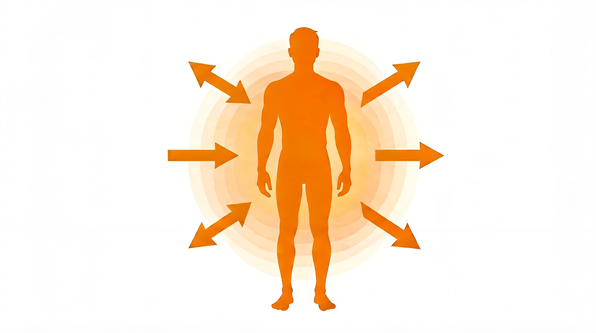
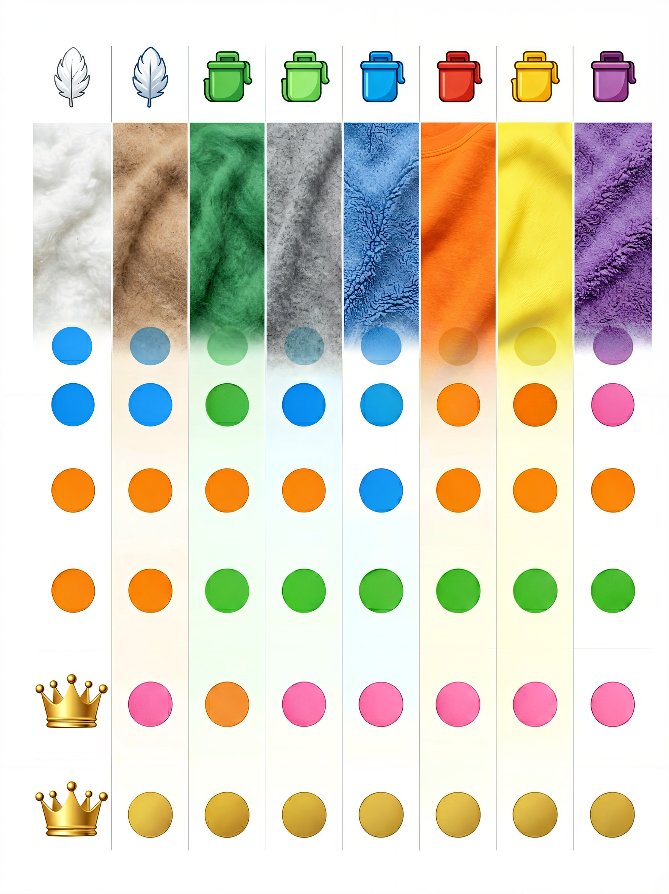

# 冬季保暖面料指南：羽绒、羊毛、抓绒、科技保暖——到底怎么选？


> **开篇**
>
> 冬天来了，你想买一件保暖的衣服。打开电商页面，看到的选项是：羽绒服、棉服、抓绒衣、羊毛大衣、羊绒衫、保暖内衣……
>
> 价格从几十到几千不等，每一件都说自己"保暖"。
>
> 但你可能不知道的是：**同样厚度的羊绒衫，保暖性是羊毛衫的 2 倍；同样重量的羽绒服，保暖性是棉服的 3 倍。** 保暖材料之间的差距，比大多数人想象的大得多。
>
> 这篇文章只讲一件事：**冬季保暖面料到底哪种最暖、哪种最值、哪种最适合你。**

---

## 保暖的原理：不是"发热"，是"锁住空气"



所有保暖面料的工作原理都一样——**在身体周围制造一层静止的空气**。空气是很好的热绝缘体，面料本身不发热，它只是把身体产生的热量"锁住"不让它散失。

**影响保暖效果的因素：**

| 因素 | 对保暖的影响 | 说明 |
|:----|:------------|:----|
| **空气层厚度** | 越高越暖 | 面料越蓬松，内部空气越多，越保暖 |
| **空气流动性** | 越低越暖 | 面料阻止空气流动的能力越强，越保暖 |
| **面料重量** | 越高越暖 | 更多的材料意味着更多的空气层，但更重 |
| **湿度** | 越低越暖 | 湿了之后空气被水取代，保暖性急剧下降 |

---

## 常见保暖材料对比



| 材料 | 保暖重量比 | 潮湿时表现 | 压缩性 | 透气性 | 价格 | 耐久性 |
|:----|:---------:|:---------:|:-----:|:-----:|:---:|:-----:|
| **羽绒** | ★★★★★ | ★（差） | ★★★★★ | ★★★ | 中-高 | ★★★★★ |
| **羊绒** | ★★★★★ | ★★ | ★★★ | ★★★★ | 高 | ★★ |
| **美利奴羊毛** | ★★★★ | ★★★ | ★★★ | ★★★★★ | 中高 | ★★★ |
| **普通羊毛** | ★★★ | ★★ | ★★ | ★★★ | 中 | ★★★ |
| **抓绒** | ★★★ | ★★★★ | ★★ | ★★★★★ | 低 | ★★★ |
| **合成棉服** | ★★★ | ★★★★ | ★★★ | ★★★ | 低-中 | ★★★ |
| **腈纶** | ★★ | ★★ | ★★ | ★★★ | 低 | ★★ |
| **摇粒绒** | ★★★ | ★★★★ | ★★ | ★★★★ | 低 | ★★★ |

---

## 各保暖材料详解

### 羽绒——保暖之王

羽绒是保暖性最好的材料，没有之一。它的保暖原理是**蓬松的绒朵**——每朵羽绒由数十个绒丝组成，绒丝之间可以储存大量静止空气。

**羽绒的核心指标：**

| 指标 | 含义 | 范围 | 参考 |
|:----|:-----|:----|:----|
| **蓬松度（Fill Power）** | 一盎司羽绒能占据的立方英寸数 | 550-900+ | 650+ 算好，800+ 优秀 |
| **充绒量** | 衣服里填充了多少克羽绒 | 50-300g | 根据场景选择 |
| **含绒量** | 绒朵占填充物的百分比 | 70-95% | 90% 以上算好 |
| **绒丝含量** | 碎绒丝的比例 | 越高越差 | 含绒量 90% = 绒朵 90% + 绒丝 10% |

**不同场景的羽绒选择：**

| 场景 | 蓬松度 | 充绒量 | 说明 |
|:----|:------|:------|:----|
| 城市通勤 | 550-650 | 80-120g | 够用就行，不用追求高蓬松度 |
| 轻度户外 | 650-750 | 100-150g | 蓬松度和充绒量的平衡点 |
| 徒步露营 | 750-850 | 120-200g | 可压缩、轻量 |
| 高海拔/极寒 | 800-900+ | 200-300g+ | 极限环境，不惜成本 |

**羽绒的致命弱点：** 湿了之后保暖性几乎为零。绒毛湿了会粘连，空气层消失，保暖性直降为零。**在潮湿多雨的环境，羽绒不如抓绒或合成棉服可靠。**

### 羊绒——最轻的日常保暖

羊绒（Cashmere）来自山羊的底层绒毛，纤维直径 14-16μm，比最细的羊毛还要细。

**羊绒为什么暖：**
- 纤维极细，同样重量下可以织出更多的空气层
- 保暖性是羊毛的 **1.5-2 倍**
- 重量极轻，一件羊绒衫约 150-200g

**羊绒的选购要点：**
- 羊绒含量 ≥ 95% 才能标注"纯羊绒"
- 100-200 元以下的"羊绒衫"基本是混纺或羊毛冒充
- 羊绒起球是正常现象，不是质量问题
- 羊绒必须手洗或干洗

### 美利奴羊毛——全能型保暖

美利奴羊毛的纤维直径 15-22μm，是唯一可以直接贴身穿的羊毛。它的保暖性不如羊绒，但在**排汗、防臭、透气**方面更胜一筹。

**美利奴羊毛的独特优势：**
- 天然防臭——可以穿 3-5 天不臭
- 吸湿排汗——即使湿了也保持一定保暖性
- 透气性好——运动时不会闷

### 抓绒——便宜又实用

抓绒（Fleece）是聚酯纤维制成的绒面面料，保暖性不如羽绒，但**湿了也能保暖**，价格便宜，透气性好。

**抓绒的常见类型：**

| 类型 | 厚度 | 保暖性 | 适合场景 |
|:----|:----|:-----:|:--------|
| 微绒 | 薄 | ★★ | 春秋外套、冬季中间层 |
| 中层抓绒 | 中 | ★★★ | 冬季中间层、日常外套 |
| 高蓬抓绒 | 厚 | ★★★★ | 冬季外套、营地保暖 |

### 合成棉服——羽绒的替代方案

合成棉服（如 Primaloft、Thinsulate、3M Thinsulate）是用极细的聚酯纤维模拟羽绒的蓬松结构。

**合成棉服 vs 羽绒：**

| 对比项 | 合成棉服 | 羽绒 |
|:------|:--------|:----|
| 保暖重量比 | ★★★ | ★★★★★ |
| 潮湿时保暖 | ✅ 仍然保暖 | ❌ 几乎不保暖 |
| 压缩性 | 中等 | 优秀 |
| 寿命 | 3-5 年 | 10-20 年 |
| 价格 | 低-中 | 中-高 |

---

## 不同温度下的穿衣方案

### 10℃ 到 15℃

| 方案 | 组合 | 适合 |
|:----|:-----|:----|
| 轻量 | 长袖T恤 + 薄外套 | 日间活动，步行 |
| 标准 | 衬衫 + 羊毛衫 | 办公室通勤 |
| 运动 | 速干长袖 + 薄抓绒 | 跑步、骑行 |

### 0℃ 到 10℃

| 方案 | 组合 | 适合 |
|:----|:-----|:----|
| 日常 | 保暖内衣 + 羊毛衫 + 薄羽绒服 | 通勤、日常 |
| 户外 | 美利奴羊毛打底 + 抓绒 + 软壳 | 徒步、露营 |
| 运动 | 美利奴羊毛轻量 + 防风夹克 | 跑步（身体产热多） |

### -5℃ 到 0℃

| 方案 | 组合 | 适合 |
|:----|:-----|:----|
| 日常 | 保暖内衣 + 羊绒衫 + 羽绒服 | 城市通勤 |
| 户外 | 美利奴羊毛中量 + 抓绒 + 硬壳 | 徒步、滑雪 |
| 极简 | 厚抓绒 + 防风外套 | 短时间户外 |

### -10℃ 以下

| 方案 | 组合 | 适合 |
|:----|:-----|:----|
| 日常 | 保暖内衣 + 羊毛衫 + 羽绒服（厚） | 城市通勤 |
| 户外 | 美利奴羊毛重量 + 抓绒 + 羽绒服 + 硬壳 | 极寒徒步 |
| 静止 | 保暖内衣 + 羽绒服 + 羽绒裤 | 等待、观景 |

---

## 常见误区

### 误区 1：「羽绒服越厚越暖」

羽绒服的保暖性取决于**蓬松度 × 充绒量**，而不是厚度。一件 800FP 蓬松度、100g 充绒量的羽绒服，保暖性可能超过一件 550FP、200g 充绒量的。**高蓬松度羽绒可以用更少的重量达到同等的保暖效果。**

### 误区 2：「羊绒起球是质量问题」

羊绒的纤维短、表面光滑，摩擦后起球是正常现象，**与质量无关**。好的羊绒起球后轻轻修剪即可恢复，差的羊绒起球后纤维断裂，直接秃了。**起球不可怕，起球后能不能恢复才是关键。**

### 误区 3：「穿得越多越暖」

穿得越多不一定越暖，关键是**每一层之间要有空气层**。如果穿得太紧，层与层之间的空气被挤走，保暖效果反而下降。**贴身穿一层紧身打底后，外面应该穿宽松一些的中间层，形成空气层。**

### 误区 4：「棉服比羽绒服差」

棉服在**干燥环境下**确实不如羽绒保暖，但在**潮湿环境下反而更可靠**。羽绒湿了就废了，棉服湿了还能保暖。如果你在南方湿冷的冬天，或者经常在雨雪中活动，**棉服可能是比羽绒更合适的选择。**

### 误区 5：「保暖内衣越厚越暖」

保暖内衣的保暖性取决于**面料结构和纤维材质**，而不是厚度。一件好的美利奴羊毛保暖内衣，厚度只有普通保暖内衣的一半，保暖性却更好。**选保暖内衣看材质（美利奴羊毛 > 聚酯纤维 > 棉），而不是看厚度。**

---

## 决策清单

买冬季保暖服装时，按这个顺序判断：

```
1. 确定使用场景
   → 城市日常通勤 → 羽绒服或羊绒衫
   → 户外运动 → 抓绒或美利奴羊毛打底+防风层
   → 潮湿环境 → 抓绒或合成棉服（不要羽绒）

2. 选择核心保暖层
   → 羽绒：最暖最轻，怕潮湿
   → 羊绒：最轻的日常保暖，需小心护理
   → 羊毛：全能型，适合多数场景
   → 抓绒：便宜实用，湿了照样暖
   → 合成棉服：潮湿环境的最佳选择

3. 检查羽绒品质
   → 蓬松度 650+ 才是好羽绒
   → 含绒量 90% 以上
   → 充绒量根据场景选择

4. 考虑搭配方式
   → 基础层 + 保暖层 + 防风层 = 完整的冬季系统
   → 每一层之间要有空气层
   → 根据活动强度调整层数

5. 预算分配
   → 贴身的打底层：投资美利奴羊毛
   → 保暖层：羽绒或羊绒，预算大头
   → 外层：防风防雨，不用太贵
```

---

> **一句话总结：** 冬季保暖没有"最好的"材料，只有"最适合你的场景"的——**干燥环境选羽绒，潮湿环境选抓绒或合成棉服，日常穿选羊绒，运动穿选美利奴羊毛。**

---

> 参考来源：GB/T 14272-2021《羽绒服装》；FZ/T 73009-2021《羊绒针织品》；GB/T 11048-2018《纺织品 生理舒适性 稳态条件下热阻和湿阻的测定》
> 最后更新：2026-07-31