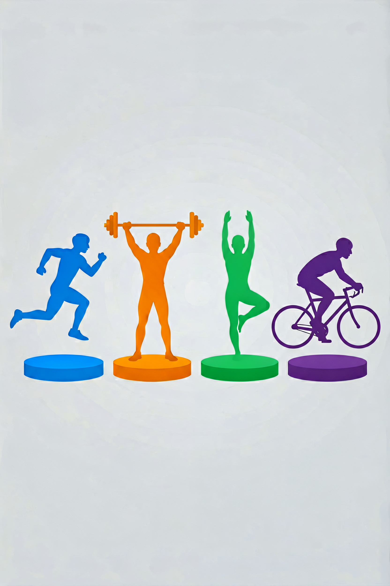
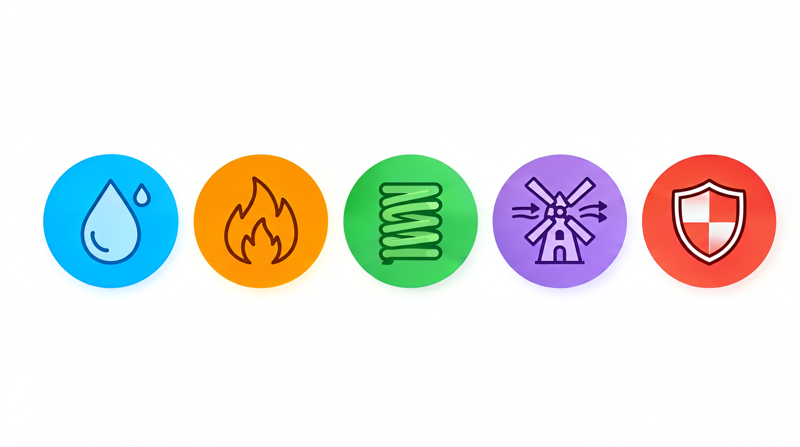

# 健身运动面料指南：为什么健身房里没人穿纯棉？



> **开篇**
>
> 你走进健身房，放眼望去——穿纯棉 T 恤的人，基本上都在做器械训练，而且衣服腋下已经湿透了。
>
> 而穿紧身速干衣的人，正在跑步机上跑得正欢，身上却看起来干干爽爽。
>
> 这不是体质差异，是**面料差异**。纯棉在健身房可以说是最差的选择——它吸汗不排汗，湿了之后贴在身上又重又不透气，运动体验大打折扣。
>
> 这篇文章讲清楚：**不同运动（跑步、举铁、瑜伽、骑行）分别该穿什么面料，为什么健身房里没人穿纯棉。**

---

## 运动面料的核心需求



运动面料和日常面料的核心区别在于：**日常面料追求"静态舒适"，运动面料追求"动态管理"——管理汗水、热量和身体活动。**

| 需求 | 为什么重要 | 对应的面料特性 |
|:----|:----------|:--------------|
| **排汗** | 汗水留在皮肤表面会蒸发带走热量，导致着凉 | 疏水性纤维，不吸水，把汗水"推"到面料表面 |
| **速干** | 湿衣服又重又不舒服，影响运动表现 | 水分蒸发速度快的纤维 |
| **弹性** | 运动需要大幅度的关节活动 | 氨纶混纺，提供 4 向弹力 |
| **透气** | 运动时身体产热是静息的 5-10 倍 | 面料结构疏松或带有透气孔 |
| **防臭** | 运动后衣服上细菌滋生产生异味 | 抗菌处理或天然抗菌纤维（如美利奴羊毛） |
| **压缩** | 适度压迫可以促进血液循环，减少肌肉震颤 | 高弹力编织结构 |

---

## 不同运动的面料选择

### 举铁/力量训练

**推荐面料：** 棉涤混纺、聚酯纤维+氨纶

举铁的特点是大重量、低心率、汗量中等。服装需要**有一定的弹性**（深蹲、硬拉需要关节活动），但不需要压缩性，也不需要最高级别的排汗。

| 面料 | 评价 | 说明 |
|:----|:----|:-----|
| **棉涤混纺（棉 50%+聚酯 50%）** | 好 | 棉的舒适+聚酯的排汗，日常健身首选 |
| **聚酯纤维+氨纶（90%+10%）** | 好 | 排汗快、有弹性，适合高强度训练 |
| **纯棉** | 差 | 吸汗不排汗，湿了重三倍 |

### 跑步/有氧

**推荐面料：** 聚酯纤维、丙纶、尼龙+氨纶

跑步的特点是持续出汗、心率高、需要最大程度的透气。**纯棉是跑步的大忌**——湿棉贴在身上，在户外跑步时被风一吹，容易着凉。

| 面料 | 评价 | 说明 |
|:----|:----|:-----|
| **聚酯纤维速干** | 最好 | 排汗快、轻量、价格低，跑步首选 |
| **丙纶** | 最好 | 完全不吸水，排汗最快，但手感偏硬 |
| **尼龙+氨纶压缩** | 好 | 适合长跑，压缩减少肌肉震颤 |
| **纯棉** | ❌ 不要穿 | 吸汗后变重、贴肤、不排汗 |

### 瑜伽/普拉提

**推荐面料：** 尼龙+氨纶、莫代尔+氨纶

瑜伽的特点是低强度、大幅度伸展、需要面料有极好的弹性。**4 向弹力**是必须的——面料在经纬两个方向都能拉伸。

| 面料 | 评价 | 说明 |
|:----|:----|:-----|
| **尼龙 80%+氨纶 20%** | 最好 | 弹性好、耐磨、手感顺滑 |
| **莫代尔+氨纶** | 好 | 柔软亲肤，适合舒缓瑜伽 |
| **聚酯纤维+氨纶** | 一般 | 弹性够但手感不如尼龙顺滑 |

### 骑行

**推荐面料：** 聚酯纤维、尼龙+氨纶

骑行的特点是长时间保持同一姿势、臀部和大腿持续摩擦、需要**减少风阻**。骑行裤的垫裆（Chamois）是另一个需要考虑的因素。

| 面料 | 评价 | 说明 |
|:----|:----|:-----|
| **聚酯纤维+氨纶骑行服** | 最好 | 排汗、贴合、减少风阻 |
| **尼龙骑行裤** | 好 | 耐磨、弹性好，适合长途骑行 |
| **纯棉** | ❌ 不要穿 | 湿了之后摩擦增大，容易磨破皮肤 |

### 游泳

**推荐面料：** 聚酯纤维+氨纶、尼龙+氨纶

泳装的需要**耐氯、抗海水、快干**。氨纶含量越高弹性越好，但越不耐氯。

| 面料 | 评价 | 说明 |
|:----|:----|:-----|
| **聚酯纤维 80%+氨纶 20%** | 最好 | 耐氯性好，寿命长 |
| **尼龙+氨纶** | 好 | 手感好，但不如聚酯纤维耐氯 |

---

## 压缩衣：真的有用吗？

压缩衣（Compression Wear）通过紧身的面料对身体施加适度压力，宣称有多种效果。我们来拆解哪些是真实的、哪些是营销。

| 宣称效果 | 科学依据 | 结论 |
|:---------|:--------|:----|
| 减少肌肉酸痛 | 压缩促进血液循环，加速代谢废物清除 | ✅ 有一定效果，但程度有限 |
| 减少肌肉震颤 | 紧身面料物理限制肌肉晃动 | ✅ 真实有效 |
| 提高运动表现 | 压缩衣本身不产生力量 | ❌ 没有直接证据 |
| 加速恢复 | 运动后穿压缩衣可能加速恢复 | ✅ 部分研究支持 |
| 燃烧更多脂肪 | 压缩衣不消耗额外能量 | ❌ 营销话术 |

**选购要点：** 压缩衣的关键是**压力梯度**——从下往上压力递减，促进血液回流。好的压缩衣在不同部位有不同的压力等级，不是"越紧越好"。

---

## 运动内衣——女性运动最重要的装备

运动内衣（Sports Bra）是女性运动时最重要的服装，没有之一。它的核心功能是**减少乳房运动**，防止乳房悬韧带被拉伤。

### 按运动强度选择

| 强度 | 运动类型 | 内衣类型 | 说明 |
|:----|:--------|:--------|:----|
| **低强度** | 瑜伽、散步、拉伸 | 低压型（瑜伽内衣） | 舒适为主，支撑性一般 |
| **中强度** | 骑行、力量训练、徒步 | 中压型（压缩式） | 将乳房压向胸壁，适合中等尺寸 |
| **高强度** | 跑步、跳跃、HIIT | 高压型（包裹式） | 每个乳房单独包裹，支撑性最强 |

### 运动内衣的面料

| 面料 | 优势 | 劣势 |
|:----|:----|:----|
| **尼龙+氨纶** | 弹性好、手感顺滑、支撑性好 | 不透气 |
| **聚酯纤维+氨纶** | 排汗快、轻量 | 手感不如尼龙 |
| **棉+氨纶** | 舒适 | 排汗差，不适合高强度运动 |

---

## 各运动场景选择方案

### 日常健身

| 运动 | 上衣 | 下装 | 备注 |
|:----|:----|:----|:----|
| 举铁 | 棉涤混纺T恤 | 棉涤混纺短裤/长裤 | 宽松为主，方便活动 |
| 跑步 | 聚酯纤维速干T恤 | 聚酯纤维短裤/紧身裤 | 越轻越好，不要穿棉 |
| 瑜伽 | 尼龙+氨纶背心 | 尼龙+氨纶瑜伽裤 | 4 向弹力是必须的 |
| 骑行 | 聚酯纤维骑行服 | 尼龙+氨纶骑行裤 | 骑行裤必须有垫裆 |

### 季节考虑

| 季节 | 运动 | 面料选择 |
|:----|:----|:--------|
| 夏季 | 室外跑步 | 聚酯纤维速干背心+短裤，戴帽子防晒 |
| 冬季 | 室外跑步 | 美利奴羊毛打底+防风夹克 |
| 夏季 | 室内健身 | 棉涤混纺T恤+短裤，空调房不用太厚 |
| 冬季 | 室内健身 | 聚酯纤维速干长袖+长裤 |

---

## 常见误区

### 误区 1：「纯棉最舒服，运动穿最好」

纯棉在**静止状态下**确实舒服，但运动时出汗后，棉纤维会吸水膨胀，贴在身上，又重又不透气。**运动时穿纯棉，体验远不如聚酯纤维或尼龙。** 棉只适合低强度、不出汗的活动。

### 误区 2：「运动服越紧越好」

运动服不是越紧越好。**压缩衣需要适度的压力，不是"勒在身上"。** 过紧的运动服会影响血液循环，限制呼吸，反而降低运动表现。合适的压缩衣应该感觉"包裹但不勒"。

### 误区 3：「运动内衣和普通内衣一样」

运动中乳房的运动会达到静止时的 **3-5 倍**，普通内衣无法提供足够的支撑。**运动内衣是保护乳房悬韧带的功能性装备**，不是普通内衣的"运动版"。穿普通内衣做高强度运动，长期可能导致乳房下垂。

### 误区 4：「运动服可以穿一整天」

运动服的排汗面料在运动后可能已经**吸附了汗液中的细菌和油脂**。穿着运动服长时间坐着，反而可能因为不透气导致皮肤问题。**建议运动后及时更换，不要穿运动服通勤一整天。**

### 误区 5：「贵的运动服一定比便宜的好」

运动服的价格差异主要来自**面料科技、剪裁、设计**。对于日常健身来说，**中档价位的聚酯纤维混纺运动服已经足够好**。贵价运动服的优势在于更精细的剪裁、更好的面料手感、更耐洗，但运动功能性的实际差异没有价格差异那么大。

---

## 决策清单

买运动服时，按这个顺序判断：

```
1. 确定运动类型
   → 举铁 → 棉涤混纺，宽松有弹性
   → 跑步 → 聚酯纤维速干，越轻越好
   → 瑜伽 → 尼龙+氨纶，4 向弹力
   → 骑行 → 紧身骑行服，减少风阻

2. 看面料成分
   → 聚酯纤维/尼龙为主（排汗速干）
   → 氨纶 5-20%（根据弹性需求）
   → 避免纯棉（运动时不要穿）

3. 检查弹性
   → 拉伸面料，看是否回弹
   → 4 向弹力（瑜伽、骑行需要）
   → 2 向弹力（举铁、日常可以）

4. 女性——选对运动内衣
   → 低强度 → 瑜伽内衣
   → 中强度 → 压缩式
   → 高强度 → 包裹式

5. 试穿感受
   → 贴合但不勒
   → 关节活动不受限
   → 不摩擦皮肤（检查缝线）
```

---

> **一句话总结：** 运动时穿什么面料，直接影响你的运动体验。**棉只适合不动的时候穿，动起来请选择聚酯纤维、尼龙、氨纶的混纺面料。**

---

> 参考来源：GB/T 22853-2009《针织运动服》；FZ/T 73013-2010《针织运动文胸》；GB/T 32614-2016《户外运动服装 冲锋衣》
> 最后更新：2026-07-31