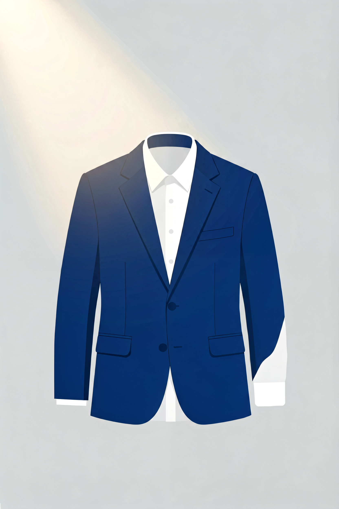

# 商务正装面料指南：西装和衬衫的面料，到底怎么选？

同样看起来是"黑色羊毛西装"，有的穿三年依然挺括，有的穿三个月就起球发亮。区别不在品牌，在面料。

西装和衬衫的面料选择，有一套相对固定的标准——支数、织法、里衬工艺——这些参数决定了这件正装能穿多久。

---

## 西装面料：羊毛是绝对主流

超过 90% 的西装面料是羊毛。羊毛天然具有弹性、透气性、抗皱性，是做西装的最佳材料。

**支数（Super 数）越高，面料越柔软顺滑，但越不耐用。**

**Super 100-130 是日常西装的最佳选择——舒服、耐穿、价格合理。** Super 150 以上适合正式场合，但不要日常穿，太娇贵，容易磨亮。不要盲目追求高支数，Super 200+ 的西装可能穿几次就磨亮了。

**商务正装选精纺，休闲西装选粗纺。**

---

## 里衬工艺决定西装品质

**全麻衬**——天然马毛/羊毛麻衬，最自然的垂感、最耐穿。价格最高，三五万起步。

**半麻衬**——麻衬从胸部到腰部，以下用粘合衬。性价比最高，大多数 3000-8000 元的西装都是半麻衬。

**粘合衬**——用热熔胶把衬布粘在面料上。便宜，但穿久了胸前可能出现气泡。

**半麻衬是性价比最高的选择。**

---

## 衬衫面料：棉花是绝对主流

**好的衬衫一定标注"长绒棉"或"埃及棉"。** 没有标注棉花品种的衬衫，基本是普通陆地棉。

**80-100S 是日常通勤衬衫的最佳选择。** 120S 以上适合正式场合，但需要干洗、熨烫，护理成本高。

**免烫衬衫适合差旅和日常通勤，但免烫处理会降低棉的透气性和柔软度。** 追求极致舒适的话，选非免烫衬衫。

---

## 各场景选择

**日常通勤：** 精纺羊毛 Super 100-130，半麻衬。长绒棉 80-100S 衬衫。

**正式会议/面试：** 精纺羊毛 Super 130-150，深色（藏青/深灰）。白色或浅蓝衬衫。

**夏季商务：** 亚麻或羊毛亚麻混纺西装，透气凉快。

**差旅：** 羊毛+聚酯纤维混纺，抗皱耐穿。配免烫衬衫。

---

> 参考来源：GB/T 2664-2017《男西服、大衣》；GB/T 2660-2017《衬衫》；FZ/T 24002-2015《精梳毛织品》
> 最后更新：2026-07-31