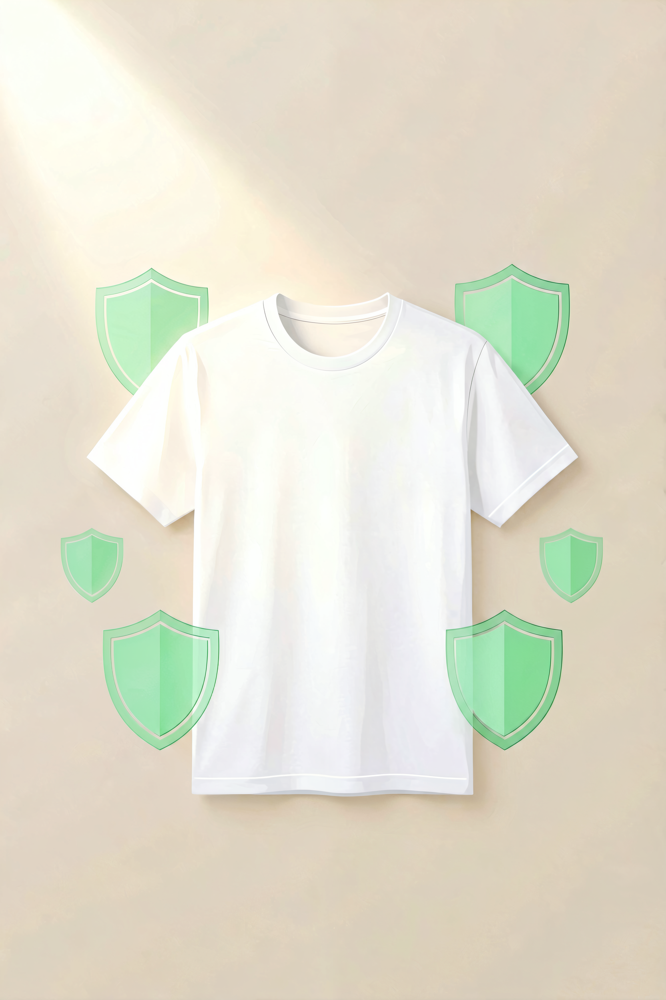
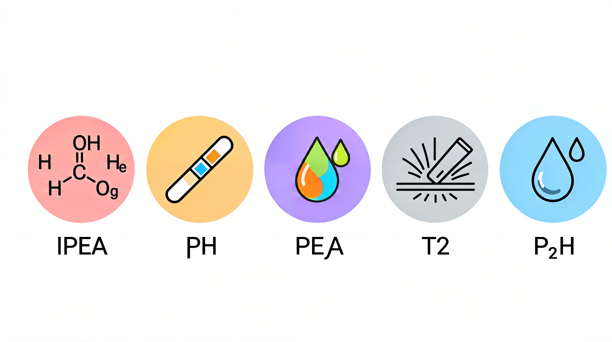

# 敏感肌与特殊体质面料指南：你的皮肤，到底适合穿什么？



> **开篇**
>
> 你买了一件新衣服，标签上写着"纯棉 100%"，穿了一天，身上却起了红疹。
>
> 你以为是过敏，换了另一件纯棉，还是痒。
>
> 问题可能不在"棉"本身，而在**面料加工过程中残留的化学物质**——甲醛、荧光增白剂、pH 值偏碱、染料中的重金属……这些看不见的东西，对敏感肌来说就是"皮肤杀手"。
>
> 这篇文章专门给敏感肌、湿疹、过敏体质、接触性皮炎人群写的：**选衣服面料时，到底要注意什么才能不刺激皮肤。**

---

## 面料对皮肤的刺激来源



面料刺激皮肤，主要来自四个方面：

| 刺激源 | 来源 | 症状 |
|:------|:-----|:-----|
| **甲醛残留** | 面料防皱、防缩整理工艺 | 皮肤发红、瘙痒、皮疹 |
| **pH 值偏碱** | 面料染色和后整理残留 | 皮肤干燥、脱皮 |
| **分散染料** | 合成纤维的染料（尤其是深色） | 接触性皮炎 |
| **纤维摩擦** | 粗糙的纤维表面反复摩擦皮肤 | 机械性刺激、发红 |
| **闷热不透气** | 面料透气性差，汗液滞留 | 痱子、毛囊炎、湿疹加重 |

---

## 敏感肌的面料选择排名

### 最安全的面料

| 排名 | 面料 | 为什么安全 | 适合场景 |
|:---:|:----|:----------|:--------|
| 1 | **有机棉（A 类）** | 无农药残留、无化学整理、A 类标准 | 贴身穿、内衣、睡衣 |
| 2 | **真丝（桑蚕丝）** | 天然蛋白纤维，pH 值接近人体皮肤 | 睡衣、围巾、敏感期 |
| 3 | **莫代尔** | 比棉更软，表面光滑，摩擦小 | 内衣、家居服 |
| 4 | **天丝（莱赛尔纤维）** | 表面光滑，吸湿性好，制造过程无有害化学残留 | 贴身衣物、夏季服装 |
| 5 | **美利奴羊毛（超细）** | 纤维直径 < 18μm，不扎人 | 秋冬打底、户外 |

### 需要谨慎的面料

| 面料 | 风险 | 建议 |
|:----|:----|:----|
| **普通羊毛（>25μm）** | 纤维粗，表面鳞片刺激皮肤 | 贴身穿必须选美利奴羊毛 |
| **聚酯纤维** | 透气性差，汗液滞留引起闷热型皮炎 | 可穿外层，不要贴身穿 |
| **尼龙** | 吸湿性差，汗液刺激 | 可穿外层，运动时贴身穿问题不大 |
| **腈纶** | 手感粗糙，静电多 | 建议不要贴身穿 |
| **深色化纤** | 分散染料可能引起过敏 | 贴身穿选浅色 |

### 避免的面料

| 面料 | 风险 | 替代方案 |
|:----|:----|:--------|
| **未洗的新衣服（任何面料）** | 甲醛残留、染料浮色 | 新衣服必须先洗再穿 |
| **C 类贴身穿** | 甲醛含量高（≤300 mg/kg） | 贴身穿必须选 B 类以上 |
| **劣质蕾丝/花边** | 胶水、染料、硬质纤维 | 选纯棉或真丝绸缎装饰 |
| **免烫处理面料** | 甲醛含量高 | 选非免烫面料 |

---

## 敏感肌的选购核心原则

### 原则一：安全类别必须 B 类以上

对于敏感肌来说，**安全类别比面料成分更重要**。

| 安全类别 | 甲醛上限 | 建议 |
|:--------|:--------|:----|
| **A 类（婴幼儿）** | ≤ 20 mg/kg | 严重敏感肌的首选 |
| **B 类（直接接触皮肤）** | ≤ 75 mg/kg | 日常敏感肌可以穿 |
| **C 类（非直接接触皮肤）** | ≤ 300 mg/kg | ❌ 不要贴身穿 |

**选购要点：** 严重敏感肌的贴身衣物，建议直接买 A 类。A 类不仅甲醛含量最低，在 pH 值、色牢度方面也是最严格的。

### 原则二：新衣服必须洗了再穿

新衣服在出厂前经过了染色、定型、防皱等多道化学处理，面料表面残留的甲醛、染料浮色、浆料，对敏感肌就是直接的刺激。

**正确的处理方式：**
1. 新衣服买回来先用 **40℃ 温水 + 少量中性洗涤剂**浸泡 30 分钟
2. 清水漂洗 2-3 遍，直到水不再变色
3. 正常晾干
4. 如果还有刺鼻气味，多洗一次

### 原则三：选浅色，不要选深色

深色面料需要使用更多的染料，染料残留和重金属含量更高。对于敏感肌来说，**贴身穿的面料，颜色越浅越安全。**

| 颜色 | 安全性 | 说明 |
|:----|:------|:----|
| **白色/本白** | 最安全 | 染料最少，但注意荧光增白剂 |
| **浅米色/浅灰** | 安全 | 少量染料，风险低 |
| **浅粉/浅蓝** | 较安全 | 中等风险 |
| **深色（黑/藏青/深红）** | 风险较高 | 染料多，需要多洗几次 |
| **荧光色** | 风险最高 | 含荧光染料，敏感肌不要贴身穿 |

### 原则四：注意标签上的"处理"字样

| 标签上的字样 | 含意 | 对敏感肌的影响 |
|:------------|:----|:--------------|
| "免烫""防皱" | 经过了树脂整理，含甲醛 | 敏感肌尽量避免 |
| "防水""防污" | 表面有化学涂层 | 可能影响透气性 |
| "抗菌" | 添加了抗菌剂 | 可能刺激皮肤 |
| "柔软整理" | 使用了柔软剂 | 通常无害，但可能掩盖面料本身的问题 |

---

## 不同皮肤问题的面料选择

### 湿疹/特应性皮炎

| 建议 | 原因 |
|:----|:-----|
| 选 A 类纯棉或真丝 | 最温和，不刺激 |
| 避免羊毛（包括美利奴） | 部分湿疹患者对羊毛蛋白过敏 |
| 避免聚酯纤维贴身穿 | 不透气，汗液滞留加重湿疹 |
| 穿宽松款 | 减少摩擦刺激 |
| 新衣服洗 3 次以上再穿 | 确保化学残留物洗净 |

### 接触性皮炎

| 建议 | 原因 |
|:----|:-----|
| 选白色或浅色 | 减少染料接触 |
| 避免深色化纤贴身穿 | 分散染料是常见的过敏原 |
| 关注镍过敏（牛仔裤扣子、拉链） | 金属过敏和面料无关，但容易被忽略 |
| 标签部位如果发痒，剪掉标签 | 标签的材质和油墨可能刺激皮肤 |

### 痱子/汗疹

| 建议 | 原因 |
|:----|:-----|
| 选透气性最好的面料（亚麻、天丝、棉） | 减少汗液滞留 |
| 避免聚酯纤维和尼龙贴身穿 | 不透气，汗液排不出去 |
| 穿宽松款 | 面料不贴在皮肤上，空气流通更好 |
| 夏天选浅色 | 浅色反射热量，减少出汗 |

---

## 各场景的选择方案

### 日常贴身穿

| 品类 | 推荐面料 | 安全类别 |
|:----|:--------|:--------|
| 内裤 | 莫代尔、有机棉、天丝 | A 类或 B 类 |
| 文胸 | 棉、莫代尔（里料为纯棉） | B 类以上 |
| T 恤 | 有机棉、天丝 | B 类以上 |
| 睡衣 | 真丝、有机棉、莫代尔 | A 类或 B 类 |
| 袜子 | 棉（长绒棉最佳） | B 类以上 |

### 特殊情况

| 场景 | 推荐 | 说明 |
|:----|:-----|:------|
| 皮肤敏感期（正在发作） | 真丝睡衣 | 摩擦最小、pH 值最接近皮肤 |
| 夏季敏感肌 | 天丝、亚麻 | 透气、凉感、减少出汗 |
| 冬季敏感肌 | 美利奴羊毛（超细） | 保暖、不扎人、透气 |
| 婴儿敏感肌 | A 类有机棉 | 最安全、无化学残留 |

---

## 常见误区

### 误区 1：「纯棉一定不会过敏」

纯棉本身确实很少引起过敏，但**纯棉面料在加工过程中可能残留甲醛、荧光增白剂、浆料**。一件没有充分水洗的纯棉新衣服，同样可能引起敏感肌反应。**不是棉的问题，是加工残留的问题。**

### 误区 2：「敏感肌只能穿纯棉」

纯棉的透气性好、舒适，但**不是唯一的选择**。莫代尔比棉更软，天丝比棉更滑，真丝比棉更亲肤。对于敏感肌来说，**选择的标准不是"天然还是化纤"，而是"表面是否光滑、化学残留是否少"。**

### 误区 3：「贵的衣服对敏感肌更安全」

价格和安全类别没有直接关系。一件几千块的 Designer 品牌羊毛衫，安全类别可能是 C 类（不适合贴身穿）；一件几十块的优衣库 T 恤，安全类别可能是 B 类（适合贴身穿）。**看安全类别，不看价格。**

### 误区 4：「敏感肌不能穿化纤」

化纤的问题是不透气导致的闷热和汗液滞留，**不是化纤本身有毒**。聚酯纤维和尼龙在运动场景中贴身穿，对敏感肌也是可以接受的，只要运动后及时更换。**关键不是"能不能穿"，而是"穿多久、穿完换不换"。**

### 误区 5：「多洗几次衣服就不刺激了」

多洗确实能减少化学残留，但**如果面料本身（如粗羊毛、硬质蕾丝）对皮肤有物理摩擦刺激，洗多少次都没用**。刺激分为化学刺激和物理刺激，水洗只能解决化学刺激，物理刺激需要换面料。

---

## 决策清单

敏感肌买衣服时，按这个顺序判断：

```
1. 看安全类别
   → 贴身穿 → B 类以上（严重敏感肌选 A 类）
   → 外套 → C 类可以，但领口内里应为 B 类以上
   → 没有标注 → 不要买

2. 选面料种类
   → 最安全：有机棉、真丝、莫代尔、天丝
   → 谨慎：普通羊毛、聚酯纤维、尼龙
   → 避免：粗纺羊毛、劣质化纤、免烫处理

3. 选颜色
   → 白色/浅色 > 深色 > 荧光色
   → 贴身穿的衣物尽量选浅色

4. 新衣服处理
   → 温水浸泡 30 分钟
   → 中性洗涤剂
   → 漂洗 2-3 遍
   → 严重敏感肌：洗 3 次以上再穿

5. 试穿观察
   → 穿一天后皮肤是否有反应
   → 如果有反应，换一种面料试试
   → 记录哪些面料/颜色/类别对你最安全
```

---

> **一句话总结：** 敏感肌选面料，**安全类别（A类/B类）比面料成分更重要，浅色比深色更安全，新衣服洗了再穿比直接穿更安全。**

---

> 参考来源：GB 18401-2010《国家纺织产品基本安全技术规范》；GB/T 18885-2020《生态纺织品技术要求》；Oeko-Tex Standard 100 认证标准
> 最后更新：2026-07-31