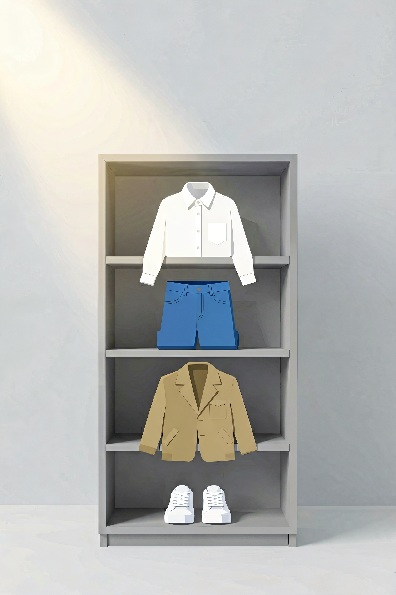

# 通勤穿搭方案：每天早起，不用再想穿什么

每天早上，你站在衣柜前，看着满柜子的衣服，却觉得"没衣服穿"。

这不是你的问题——这是决策疲劳。每天要在有限的时间内，从几十件单品中选出一套搭配，还要考虑场合、天气、季节。

**解决这个问题的方法不是"买更多衣服"，而是建立一套自己的穿搭公式。**

---

## 核心思路：减少决策成本

通勤穿搭追求的是"不出错"，而不是"出彩"。

**将日常穿搭的决策从"我今天穿什么"简化为"我今天穿哪一套"。** 你不需要每次都重新搭配，只需要在固定的方案中选择。

---

## 基础单品清单

**上装（6-7 件）：** 白 T 恤 ×2、条纹衫 ×1、白衬衫 ×1、浅蓝衬衫 ×1、针织衫 ×1、卫衣 ×1。

**下装（4-5 件）：** 深色牛仔裤 ×1、卡其裤 ×1、西裤 ×1、休闲短裤 ×1。

**外套（3-4 件）：** 休闲西装 ×1（藏青，通勤万能单品）、风衣 ×1、牛仔夹克 ×1、轻薄羽绒服 ×1。

**鞋（3-4 双）：** 小白鞋 ×1（百搭之王）、乐福鞋 ×1、皮鞋 ×1、靴子 ×1。

---

## 不同行业的穿搭公式

**互联网/科技：** 白 T 恤 + 卡其裤 + 小白鞋。干净整洁即可，不需要正装。

**金融/法律/咨询：** 衬衫 + 西裤 + 皮鞋。正式得体，但不一定每天穿西装三件套。

**教育/研究：** 衬衫 + 卡其裤 + 乐福鞋。专业但不刻板，舒适优先。

**创意/媒体：** 有设计感的上衣 + 基础下装。展现个性，但保持专业度。

---

## 配色方案

**基础色（黑、白、灰、藏青）**占衣橱 70%。**大地色（卡其、米色、棕色）**占 20%。**点缀色（蓝、绿、红）**占 10%。

**几套不会出错的组合：** 白+藏青+棕（经典稳重），白+灰+黑（极简干净），浅蓝+卡其+白（柔和专业）。

---

## 季节穿搭

**春季（15-20℃）：** 长袖衬衫 + 卡其裤 + 乐福鞋，风衣备用。

**夏季（25-30℃+）：** 白 T 恤 + 休闲裤 + 乐福鞋，或白 T 恤 + 短裤。

**秋季（10-20℃）：** 针织衫 + 卡其裤 + 靴子，或衬衫 + 休闲西装。

**冬季（0-10℃）：** 衬衫 + 羊毛衫 + 羽绒服 + 西裤 + 靴子。室内脱掉羽绒服。

---

## 一句话总结

**通勤穿搭不是一个审美问题，是一个效率问题。** 建立自己的穿搭公式，把决策成本降到最低。

---

> 最后更新：2026-07-31