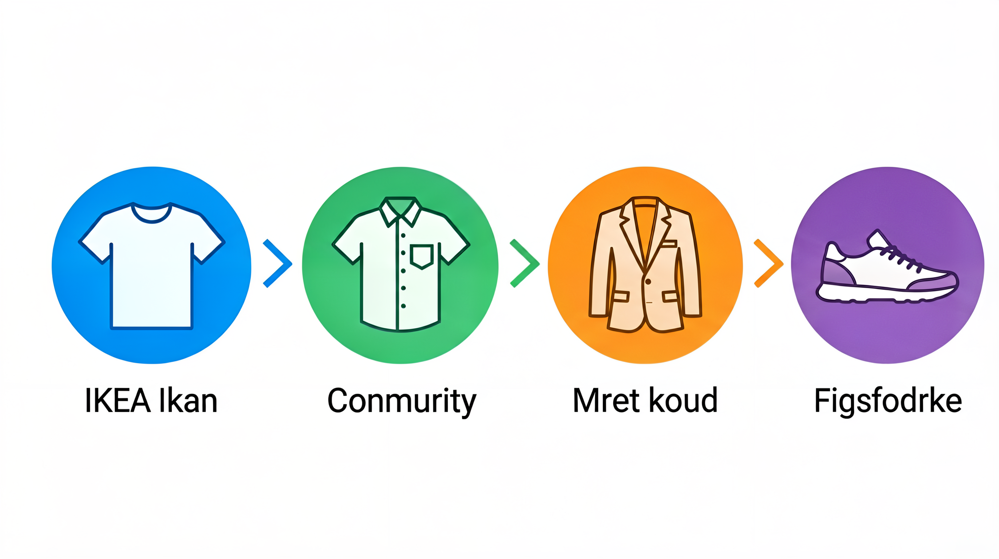

# 通勤穿搭方案：每天早起，不用再想穿什么


> **开篇**
>
> 每天早上，你站在衣柜前，看着满柜子的衣服，却觉得"没衣服穿"。
>
> 这不是你的问题——这是**决策疲劳**。每天要在有限的时间内，从几十件单品中选出一套搭配，还要考虑场合、天气、季节——这个决策成本比大多数人想象的高。
>
> 解决这个问题的方法不是"买更多衣服"，而是**建立一套自己的穿搭公式**——把日常穿搭变成一个不需要动脑的流程。这就是所谓的"制服化"（Uniform Dressing）。
>
> 这篇文章不讲潮流，不推荐品牌，只讲：**怎么用最少的衣服，覆盖最多的场景，每天早上的穿搭决策时间降到 30 秒。**

---

## 通勤穿搭的核心思路：减少决策成本



通勤穿搭和时尚穿搭的本质区别在于：**通勤穿搭追求的是"不出错"，而不是"出彩"**。

| 对比 | 时尚穿搭 | 通勤穿搭 |
|:----|:--------|:--------|
| 目标 | 表达个性、引人注目 | 得体、专业、舒适 |
| 频率 | 按场合变化 | 每天重复 |
| 决策成本 | 可接受 | 越低越好 |
| 单品数量 | 越多越好 | 越少越好 |
| 配色 | 多变、大胆 | 固定、中性 |

**通勤穿搭的底层逻辑：** 将日常穿搭的决策从"我今天穿什么"简化为"我今天穿哪一套"。你不需要每次都重新搭配，只需要在固定的方案中选择。

---

## 胶囊衣橱：用 20 件单品覆盖所有通勤场景

胶囊衣橱的核心是**用少量高搭配度的单品，覆盖所有日常场景**。

### 基础单品清单

#### 上装（6-7 件）

| 单品 | 数量 | 颜色 | 说明 |
|:----|:----|:----|:-----|
| 白 T 恤 | 2 件 | 白色 | 圆领，克重 200g+ 不透视 |
| 条纹衫 | 1 件 | 蓝白条纹 | 法式条纹，经典不过时 |
| 白衬衫 | 1 件 | 白色 | 通勤必备，可正式可休闲 |
| 浅蓝衬衫 | 1 件 | 浅蓝 | 比白衬衫柔和，适合日常 |
| 针织衫 | 1 件 | 灰色或藏青 | V 领或圆领，春秋叠穿 |
| 卫衣/帽衫 | 1 件 | 灰色 | 休闲场合，周末可穿 |

#### 下装（4-5 件）

| 单品 | 数量 | 颜色 | 说明 |
|:----|:----|:----|:-----|
| 深色牛仔裤 | 1 条 | 深蓝 | 直筒或修身，不要破洞 |
| 卡其裤 | 1 条 | 卡其 | 通勤百搭，比牛仔裤正式 |
| 西裤 | 1 条 | 深灰 | 正式场合穿 |
| 休闲短裤 | 1 条 | 卡其或深蓝 | 夏季通勤 |

#### 外套（3-4 件）

| 单品 | 数量 | 颜色 | 说明 |
|:----|:----|:----|:-----|
| 休闲西装 | 1 件 | 藏青 | 可正式可休闲，通勤万能单品 |
| 风衣 | 1 件 | 卡其 | 春秋外套，搭配所有 |
| 牛仔夹克 | 1 件 | 深蓝 | 休闲场合，周末穿 |
| 轻薄羽绒服 | 1 件 | 深色 | 冬季通勤 |

#### 鞋（3-4 双）

| 单品 | 数量 | 颜色 | 说明 |
|:----|:----|:----|:-----|
| 小白鞋 | 1 双 | 白色 | 百搭之王，几乎可以搭配任何衣服 |
| 乐福鞋 | 1 双 | 棕色或黑色 | 介于正式和休闲之间 |
| 皮鞋 | 1 双 | 棕色 | 正式场合穿 |
| 靴子 | 1 双 | 棕色 | 秋冬通勤 |

---

## 不同行业的穿搭公式

### 互联网/科技行业

**原则：** 干净整洁即可，不需要正装。

| 季节 | 公式 | 说明 |
|:----|:----|:-----|
| 春夏 | 白 T 恤 + 卡其裤 + 小白鞋 | 最经典的通勤组合 |
| 春夏 | 条纹衫 + 牛仔裤 + 乐福鞋 | 休闲中有细节 |
| 秋冬 | 针织衫 + 卡其裤 + 靴子 | 舒适保暖 |
| 秋冬 | 卫衣 + 牛仔裤 + 小白鞋 | 最休闲的方案 |

### 金融/法律/咨询行业

**原则：** 正式得体，但不一定每天西装三件套。

| 季节 | 公式 | 说明 |
|:----|:----|:-----|
| 春夏 | 衬衫 + 西裤 + 皮鞋 | 最基础的正装组合 |
| 春夏 | 衬衫 + 卡其裤 + 乐福鞋（不打领带） | 商务休闲 |
| 秋冬 | 衬衫 + 羊毛衫 + 西裤 + 皮鞋 | 叠穿有层次感 |
| 秋冬 | 衬衫 + 休闲西装 + 西裤 + 皮鞋 | 见客户的标准方案 |

### 教育/研究行业

**原则：** 专业但不刻板，舒适优先。

| 季节 | 公式 | 说明 |
|:----|:----|:-----|
| 春夏 | 衬衫 + 卡其裤 + 乐福鞋 | 专业又舒适 |
| 春夏 | 针织衫 + 牛仔裤 + 小白鞋 | 亲和力强 |
| 秋冬 | 羊毛衫 + 卡其裤 + 靴子 | 温暖有质感 |
| 秋冬 | 衬衫 + 开衫 + 休闲裤 | 经典学院风 |

### 创意/媒体行业

**原则：** 展现个性，但保持专业度。

| 季节 | 公式 | 说明 |
|:----|:----|:-----|
| 春夏 | 有设计感的上衣 + 基础下装 | 亮点集中在上半身 |
| 春夏 | 纯色 T 恤 + 亮色裤装 | 用颜色表达个性 |
| 秋冬 | 叠穿（衬衫+针织衫+外套） | 层次感是创意的体现 |
| 秋冬 | 质感外套 + 基础内搭 | 外套决定整体风格 |

---

## 配色方案

### 通勤配色原则

通勤穿搭的配色以**中性色为基础，亮色为点缀**。

| 色系 | 颜色 | 搭配建议 |
|:----|:----|:--------|
| **基础色** | 黑、白、灰、藏青 | 占衣橱 70% |
| **大地色** | 卡其、米色、棕色 | 占衣橱 20% |
| **点缀色** | 蓝、绿、红、黄 | 占衣橱 10% |

### 几套不会出错的配色

| 组合 | 效果 | 适合 |
|:----|:----|:----|
| 白 + 藏青 + 棕 | 经典、稳重 | 所有行业 |
| 白 + 灰 + 黑 | 极简、干净 | 科技、创意行业 |
| 浅蓝 + 卡其 + 白 | 柔和、专业 | 教育、金融行业 |
| 藏青 + 灰 + 白 | 正式、可靠 | 金融、法律行业 |

---

## 季节穿搭方案

### 春季

| 温度 | 方案 | 核心单品 |
|:----|:----|:--------|
| 15-20℃ | 长袖衬衫 + 卡其裤 + 乐福鞋 | 风衣备用 |
| 10-15℃ | 针织衫 + 牛仔裤 + 小白鞋 | 加一件薄外套 |

### 夏季

| 温度 | 方案 | 核心单品 |
|:----|:----|:--------|
| 25-30℃ | 短袖衬衫 + 休闲裤 + 乐福鞋 | 室内空调房备一件薄外套 |
| 30℃+ | 白 T 恤 + 短裤 + 小白鞋 | 如果是互联网行业 |

### 秋季

| 温度 | 方案 | 核心单品 |
|:----|:----|:--------|
| 15-20℃ | 衬衫 + 休闲西装 + 西裤 + 皮鞋 | 风衣可选 |
| 10-15℃ | 针织衫 + 卡其裤 + 靴子 | 加一件牛仔夹克 |

### 冬季

| 温度 | 方案 | 核心单品 |
|:----|:----|:--------|
| 0-10℃ | 衬衫 + 羊毛衫 + 羽绒服 + 西裤 + 靴子 | 室内脱掉羽绒服 |
| 0℃ 以下 | 保暖内衣 + 羊毛衫 + 大衣 + 西裤 + 皮鞋 | 围巾、手套 |

---

## 常见误区

### 误区 1：「通勤穿搭需要很多衣服」

通勤穿搭不需要很多衣服，需要的是**高搭配度**。20 件单品，如果搭配得当，可以组合出 30-40 套不同的方案。**问题不是衣服太少，而是不知道怎么搭配。**

### 误区 2：「每天穿一样不好」

每天穿类似的组合（比如"白 T 恤 + 牛仔裤 + 小白鞋"）不是问题，**只要整洁得体，没人会注意到你昨天穿的是不是同一件白 T 恤。** 乔布斯穿黑色高领衫、扎克伯格穿灰色 T 恤——制服化的核心是减少决策成本。

### 误区 3：「正式场合必须穿西装三件套」

大多数行业的"正式场合"，穿**休闲西装 + 衬衫 + 西裤 + 皮鞋（不打领带）** 就足够了。打领带在日常办公场景中反而显得过于正式。**"比周围人正式一点点"是最佳尺度。**

### 误区 4：「跟着时尚博主穿搭就行」

时尚博主的穿搭是为镜头和社交媒体设计的，不是为你的通勤设计的。**通勤穿搭要的是"连续 8 小时坐着也舒服""在同事面前不会尴尬""接客户电话可以站起来就走"**——这些要求跟时尚博主的生活场景完全不同。

---

## 决策清单

建立你的通勤穿搭系统：

```
1. 盘点现有单品
   → 按类别列出所有衣服
   → 扔掉近一年没穿过的
   → 找出最常穿的 10 件

2. 确定你的行业等级
   → 互联网/科技 → 休闲为主
   → 金融/法律 → 正装为主
   → 教育/研究 → 商务休闲
   → 创意/媒体 → 个性+专业

3. 建立基础衣橱
   → 上装 6-7 件
   → 下装 4-5 件
   → 外套 3-4 件
   → 鞋 3-4 双
   → 总计 16-20 件

4. 固定 3-4 套方案
   → 春夏通勤 2 套
   → 秋冬通勤 2 套
   → 写在手机备忘录里

5. 周末准备
   → 周日晚上把下一周的穿搭准备好
   → 早上不用想，直接穿
```

---

> **一句话总结：** 通勤穿搭不是一个审美问题，是一个效率问题。**建立自己的穿搭公式，把决策成本降到最低，每天早安心的穿，更安心的上班。**

---

> 参考来源：
> 最后更新：2026-07-31